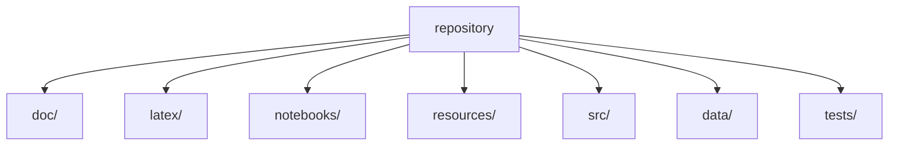
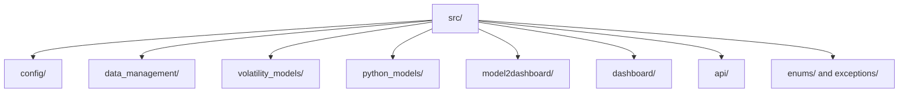

# options-pricing

Project for implied volatility modeling in options.

The main reference for this repository is the published documentation:
[https://epiblasfunds.github.io/options-pricing/](https://epiblasfunds.github.io/options-pricing/)

The repository also contains a longer written project report in `latex/`, separate from the GitHub Pages documentation.

## Quick Start

The two main notebooks are:

- `notebooks/data.ipynb`: shows how to read and prepare the data.
- `notebooks/volatility_models_training.ipynb`: shows how to train the models.

## Environment

Use **Python 3.11.0**.

Install the requirements file that matches your use case:

- `requirements.txt`: general environment and notebooks.
- `src/api/requirements.txt`: FastAPI service.
- `src/dashboard/requirements.txt`: Dash dashboard.

Example setup:

```bash
python3.11 -m venv .venv
source .venv/bin/activate
pip install -r requirements.txt
```

On Windows:

```powershell
py -3.11 -m venv .venv
.venv\Scripts\Activate.ps1
pip install -r requirements.txt
```

## Run Locally

### Dashboard

Install the dashboard dependencies:

```bash
pip install -r src/dashboard/requirements.txt
```

If you need to rebuild the dashboard artifacts first:

```bash
python -m src.model2dashboard.pipeline
```

Run the dashboard locally:

```bash
python -m src.dashboard.main
```

By default, it runs on port `8080`.

### API

Install the API dependencies:

```bash
pip install -r src/api/requirements.txt
```

Run the API locally:

```bash
python -m uvicorn src.api.main:app --host 127.0.0.1 --port 8000 --reload
```

The API will be available locally on `http://127.0.0.1:8000` and the OpenAPI docs on `http://127.0.0.1:8000/docs`.

## Repository Structure



- `doc/`: source files and generated site for the GitHub Pages documentation.
- `latex/`: extended project report and thesis-style documentation.
- `notebooks/`: guided examples for data loading and model training.
- `resources/`: project configuration files.
- `src/`: main source code.
- `data/`: working data.
- `tests/`: test suite.

## `src` Structure



- `config/`: configuration loading.
- `data_management/`: data reading and transformation pipeline.
- `volatility_models/`: training and evaluation utilities.
- `python_models/`: model abstractions and Python model classes.
- `model2dashboard/`: conversion from trained models to dashboard-ready artifacts.
- `dashboard/`: visualization app.
- `api/`: service layer for serving models.
- `enums/` and `exceptions/`: shared types and domain errors.
