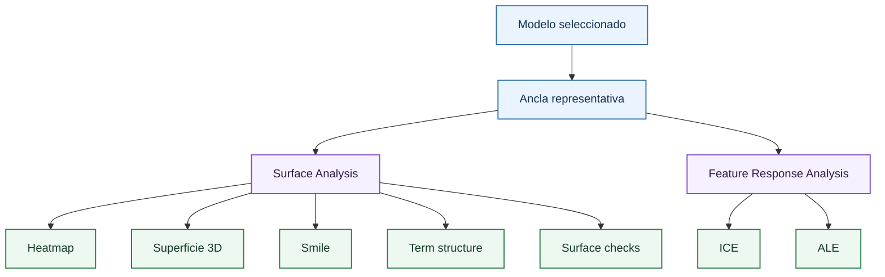

# Pestaña Behaviour And Surface

Esta página resume la pestaña que analiza el modelo como superficie financiera y como función de respuesta. El detalle teórico está dividido en [superficies de volatilidad](behaviour/volatility-surfaces.md), [curvas ICE](behaviour/ice.md) y [curvas ALE](behaviour/ale.md).

La pestaña responde a una pregunta central: si se cambia moneyness, vencimiento, strike, subyacente o tipo, cómo cambia la volatilidad predicha. Esta pregunta no se contesta con una sola métrica de error; exige inspeccionar la forma funcional aprendida.

## Surface Analysis

La sección de superficies toma una observación real como ancla y genera una grilla contrafactual de moneyness y vencimiento. El strike se reconstruye como:

$$
K = \frac{F}{m}
$$

La metodología completa se desarrolla en [superficies de volatilidad](behaviour/volatility-surfaces.md). Las vistas disponibles son:

| Vista | Uso |
| --- | --- |
| Heatmap | Lectura estable de niveles, skew, curvatura y saltos. |
| Superficie 3D | Inspección visual de pendiente y curvatura. |
| Smile | Cortes a vencimiento fijo. |
| Term structure | Cortes a moneyness fija. |
| Surface checks | Avisos heurísticos de irregularidad. |

## Feature Response Analysis

La sección de respuesta permite estudiar una feature individual. Se muestran dos herramientas:

| Herramienta | Página | Pregunta |
| --- | --- | --- |
| ICE | [Curvas ICE](behaviour/ice.md) | Cómo responde cada observación al mover una feature. |
| ALE | [Curvas ALE](behaviour/ale.md) | Qué efecto acumulado medio aparece dentro de regiones observadas. |

Estas herramientas son complementarias. [ICE](behaviour/ice.md) revela heterogeneidad; [ALE](behaviour/ale.md) resume un efecto local agregado más robusto ante correlaciones.

## Criterio de lectura

Una superficie profesionalmente defendible no es necesariamente lisa en todos los puntos, pero sí debe tener un comportamiento explicable. Si una región muestra saltos, curvas ICE erráticas o ALE con cambios abruptos, conviene revisar soporte local con [vecinos](sample/neighbours.md) y error regional en [diagnóstico](diagnosis.md).

