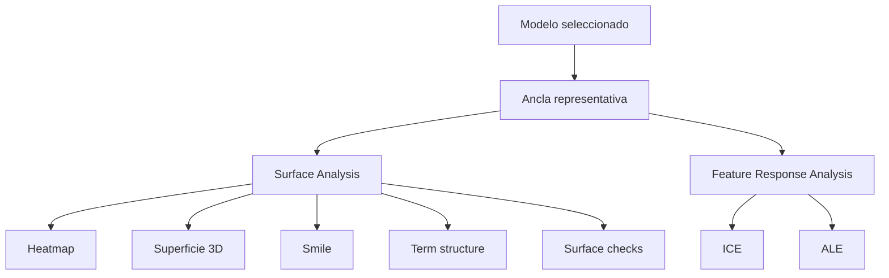
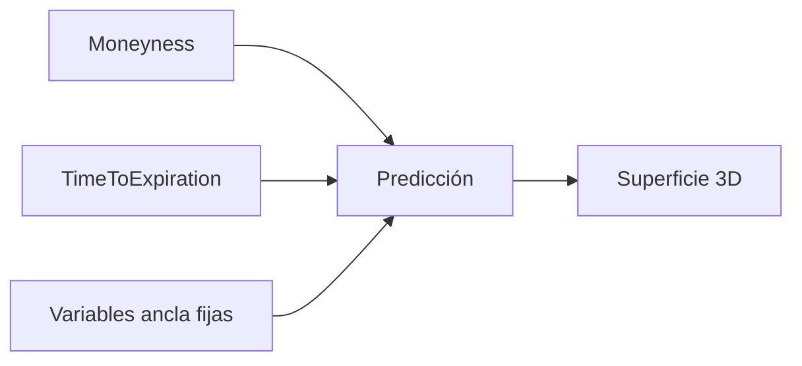

# Pestaña Behaviour And Surface

Esta pestaña analiza el comportamiento del modelo como superficie financiera. Responde a la pregunta: si cambio moneyness, vencimiento, strike, subyacente o tipo, ¿cómo se mueve la volatilidad predicha?

## Surface Analysis

La caja `Surface Analysis` agrupa todas las visualizaciones que dependen de una muestra ancla. El usuario selecciona una observación representativa; el dashboard reconstruye una superficie local alrededor de ella.

La grilla cambia moneyness entre valores configurados alrededor de la zona central y vencimiento desde corto plazo hasta un máximo relativo al vencimiento del ancla. En cada punto de la grilla se ajusta el strike manteniendo el subyacente base:

$$
K = \frac{F}{m}
$$

donde \(m\) es la moneyness deseada.

## Surface Heatmap

El heatmap muestra la volatilidad predicha sobre una grilla de moneyness y tiempo a vencimiento. Es la vista más directa para detectar:

- Nivel de volatilidad.
- Skew.
- Curvatura del smile.
- Saltos locales.
- Zonas con comportamiento poco suave.

La lectura económica es: filas y columnas representan estados contrafactuales alrededor de una operación real, y el color representa \(\hat{\sigma}\).

## Surface Slice

La superficie 3D usa la misma grilla que el heatmap, pero permite inspeccionar pendiente y curvatura visualmente. Es útil cuando la variación simultánea de moneyness y vencimiento no se aprecia bien en 2D.

## Smile Curve

El smile curve toma cortes de la superficie a vencimientos fijos:

$$
\hat{\sigma}(m \mid T=T_k)
$$

Sirve para comparar la forma del smile entre expiries. Si las líneas son muy irregulares o se cruzan de forma inesperada, puede indicar que el modelo aprendió ruido o que la región es escasa en datos.

## Term Structure

La term structure toma cortes de la superficie a moneyness fija:

$$
\hat{\sigma}(T \mid m=m_k)
$$

Permite observar si la volatilidad aumenta o disminuye con vencimiento en diferentes zonas de moneyness. Es especialmente útil para detectar sesgos del modelo en corto plazo frente a largo plazo.

## Surface Checks

La caja de checks aplica reglas heurísticas a la superficie local. No son pruebas matemáticas de no arbitraje, sino avisos prácticos:

- Cambios abruptos entre puntos cercanos.
- Discontinuidades fuertes por vencimiento.
- Comportamientos locales que merecen revisión.

Su función es señalar superficies visualmente sospechosas para no confiar solo en métricas agregadas.

## Feature Response Analysis

Esta caja permite elegir una feature de análisis y ver dos diagnósticos complementarios: ICE y ALE. La feature seleccionada actualiza ambas visualizaciones.

Las features de análisis principales son strike, subyacente, tiempo a vencimiento y tipo.

## ICE

ICE muestra curvas individuales:

$$
ICE_i(z)=f(z, x_{i,-j})
$$

Donde se cambia una feature \(z\) y se mantienen las demás variables de la observación \(i\). Permite ver heterogeneidad: dos muestras pueden responder de forma distinta al mismo cambio de strike o vencimiento.

## ALE

ALE muestra un efecto acumulado local:

$$
ALE_j(z)=\int_{z_0}^{z} E\left[\frac{\partial f(X)}{\partial x_j}\mid X_j=s\right]ds
$$

En la implementación se aproxima por bins: se predice en el borde inferior y superior de cada intervalo y se acumulan diferencias medias. Frente a PDP, ALE es más adecuado cuando las features están correlacionadas, porque evalúa cambios dentro de regiones observadas.

