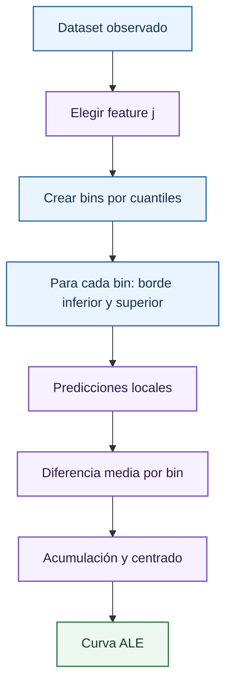

# Curvas ALE

ALE, del inglés *Accumulated Local Effects*, estima el efecto medio acumulado de una feature sobre la predicción del modelo usando variaciones locales dentro de regiones observadas. En este proyecto complementa a las [curvas ICE](ice.md): ICE enseña trayectorias individuales; ALE resume un efecto agregado menos vulnerable a combinaciones contrafactuales irreales cuando las variables están correlacionadas.

La definición continua para una feature $j$ es:

$$
ALE_j(z)=
\int_{z_0}^{z}
E\left[
\frac{\partial f(X)}{\partial X_j}
\mid X_j=s
\right]ds
-
C
$$

donde $C$ centra la curva para que su media sea cero. La interpretación es relativa: un valor ALE positivo indica que, en esa zona, la feature empuja la predicción por encima del promedio de efecto acumulado.

## Implementación en el proyecto

La función `build_ale_frame` implementa una aproximación por bins:

1. Para cada feature de análisis, toma la distribución observada en el dataset.
2. Calcula bordes por cuantiles entre 0.05 y 0.95, con 13 puntos.
3. Para cada intervalo $[l_k,u_k]$, selecciona observaciones cuyo valor cae en ese intervalo.
4. Predice dos escenarios locales: feature igual a $l_k$ y feature igual a $u_k$.
5. Calcula la diferencia media:

$$
\Delta_k =
\frac{1}{|I_k|}
\sum_{i \in I_k}
\left[
f(u_k,x_{i,-j})-f(l_k,x_{i,-j})
\right]
$$

6. Acumula incrementos:

$$
\tilde{ALE}_k=\sum_{r \leq k}\Delta_r
$$

7. Centra la curva restando la media:

$$
ALE_k = \tilde{ALE}_k - \frac{1}{K}\sum_{r=1}^{K}\tilde{ALE}_r
$$

Este procedimiento usa cambios dentro de bins donde existen datos. Por eso suele ser más prudente que PDP cuando `StrikePrice` y `UnderlyingPrice` están correlacionados o cuando vencimiento y liquidez no se distribuyen uniformemente.

## Interpretación

ALE se lee como efecto relativo acumulado:

| Forma de la curva | Lectura |
| --- | --- |
| Creciente | Al aumentar la feature, el modelo tiende a subir la volatilidad predicha. |
| Decreciente | Al aumentar la feature, el modelo tiende a bajar la volatilidad predicha. |
| Plana | Efecto marginal medio bajo en los bins observados. |
| Curvada | Efecto no lineal; la pendiente cambia por regiones. |
| Tramos irregulares | Posible escasez de datos, ruido o respuesta no suave. |

Como la curva está centrada, el cero no significa volatilidad cero ni ausencia absoluta de efecto. Significa punto de referencia del efecto acumulado medio.

## Ventaja frente a PDP

PDP evalúa $f(z,x_{i,-j})$ para todos los individuos y todos los valores $z$. Si las features están correlacionadas, puede crear puntos improbables: por ejemplo, un vencimiento extremo combinado con un strike y un subyacente que rara vez aparecen juntos. ALE reduce ese problema al comparar bordes dentro del bin de observaciones que realmente tienen valores cercanos de la feature.

En opciones, esta diferencia es importante. Las variables financieras no son independientes:

- `StrikePrice` y `UnderlyingPrice` determinan moneyness.
- `TimeToExpiration` está ligado a calendarios de vencimiento.
- `Rate` depende de la fecha y del plazo.
- La liquidez puede concentrarse en regiones concretas.

ALE no elimina todas las dificultades de correlación, pero evita promediar de forma indiscriminada sobre combinaciones globales poco realistas.

## Uso junto con ICE

[ICE](ice.md) y ALE deben leerse como complementarios:

| Herramienta | Pregunta |
| --- | --- |
| [ICE](ice.md) | Cómo cambia la predicción para observaciones individuales. |
| ALE | Qué efecto acumulado medio aparece dentro de regiones observadas. |
| [Superficie](volatility-surfaces.md) | Cómo se organiza la predicción en moneyness y vencimiento alrededor de un ancla. |

Si ICE muestra curvas muy heterogéneas y ALE es casi plano, el promedio local está ocultando diferencias entre regí­menes. Si ICE y ALE apuntan en la misma dirección, la conclusión sobre esa feature es más estable.

## Referencias

- Apley, D. W. y Zhu, J. (2020). *Visualizing the Effects of Predictor Variables in Black Box Supervised Learning Models*. Journal of the Royal Statistical Society Series B.
- Molnar, C. (2022). *Interpretable Machine Learning*. Capí­tulo de Accumulated Local Effects.
- Friedman, J. H. (2001). *Greedy Function Approximation: A Gradient Boosting Machine*. Annals of Statistics.

