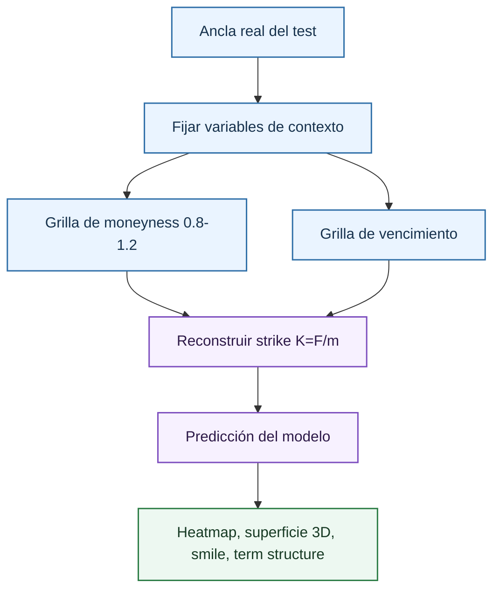

# Superficies de volatilidad

La pestaña [Behaviour And Surface](../behaviour-surface.md) trata el modelo como una función de superficie. En lugar de limitarse a predicciones punto a punto, se pregunta cómo se mueve la volatilidad estimada cuando se modifican moneyness y vencimiento alrededor de una operación real.

En opciones, la volatilidad implícita se analiza habitualmente como una superficie:

\[
\sigma = \sigma(K,T)
\]

donde:

- $\sigma$ es la volatilidad implícita.
- $K$ es el strike.
- $T$ es el tiempo hasta vencimiento.

o, de forma más comparable entre niveles de mercado:

\[
\sigma = \sigma(m,T), \quad m=\frac{F}{K}
\]

donde:

- $\sigma$ es la volatilidad implícita.
- $m$ es la moneyness, definida como $F/K$.
- $F$ es el futuro subyacente.
- $K$ es el strike.
- $T$ es el tiempo hasta vencimiento.

donde $F$ es el futuro subyacente, $K$ el strike y $T$ el tiempo hasta vencimiento. El dashboard usa esta segunda lectura, porque la moneyness permite comparar contratos aunque el nivel del IBEX cambie.

## Construcción en el repositorio

La función `build_surfaces_frame` genera las superficies. Para cada ancla seleccionada:

1. Toma una fila real del split de test.
2. Fija el subyacente base $F$.
3. Construye `surface_grid_size` valores de moneyness entre 0.8 y 1.2.
4. Construye `surface_grid_size` valores de vencimiento entre 1 día y el máximo entre $1.5$ veces el vencimiento del ancla y 30 días.
5. Reconstruye el strike como:

\[
K = \frac{F}{m}
\]

donde:

- $K$ es el strike reconstruido.
- $F$ es el precio del futuro subyacente fijado por el ancla.
- $m$ es la moneyness objetivo de la grilla.

6. Mantiene el resto de variables del ancla y predice la volatilidad con el modelo principal.

El parámetro actual `surface_grid_size` es 24. Por tanto, cada ancla genera $24 \times 24 = 576$ puntos contrafactuales. Este tamaño ofrece una superficie suficientemente densa para detectar curvatura y discontinuidades sin generar artefactos excesivamente pesados.

## Heatmap de superficie

El heatmap representa $\hat{\sigma}(m,T)$ con color. Es la visualización más estable para lectura técnica porque evita perspectiva 3D y permite detectar regiones.

Lecturas relevantes:

| Patrón | Interpretación técnica |
| --- | --- |
| Gradiente suave por moneyness | El modelo aprende skew o smile regular. |
| Curvatura central alrededor de $m=1$ | Posible estructura de smile alrededor de ATM. |
| Saltos entre celdas vecinas | Posible discontinuidad del modelo o falta de soporte local. |
| Variación extrema en corto vencimiento | Sensibilidad alta a microestructura o escasez de datos. |

El heatmap es contrafactual: algunos puntos de la grilla pueden no corresponder a contratos observados exactamente. Por eso se complementa con [vecinos locales](../sample/neighbours.md) y diagnóstico de error.

## Superficie 3D

La superficie 3D representa la misma matriz que el heatmap. Su ventaja es visual: permite ver pendientes y curvaturas cuando el color no basta. Su riesgo es que la perspectiva puede exagerar cambios. Para documentación formal, la superficie 3D debe usarse como apoyo visual, no como única evidencia.

Una superficie aceptable para un modelo de volatilidad debería evitar comportamientos erráticos no explicados. No se exige que sea perfectamente lisa, porque los datos de mercado contienen ruido y porque el modelo no impone restricciones de no arbitraje. Sin embargo, cambios abruptos en puntos muy próximos son una señal de revisión.

## Smile curve

Un smile es un corte de la superficie a vencimiento fijo:

\[
m \longmapsto \hat{\sigma}(m \mid T=T_k)
\]

donde:

- $m$ es la moneyness del corte.
- $\hat{\sigma}$ es la volatilidad predicha.
- $T_k$ es el vencimiento fijo usado para construir el smile.

El smile permite comparar cómo cambia la curvatura entre vencimientos. En muchos mercados de equity index options se espera skew: volatilidades distintas entre strikes bajos y altos. El dashboard no impone esa forma; la muestra para inspeccionar si el modelo la aprende.

Una lectura rigurosa distingue:

- Smile aprendido de forma suave.
- Skew pronunciado pero continuo.
- Líneas que se cruzan por cambios de estructura temporal.
- Oscilaciones sin soporte financiero claro.

## Term structure

La term structure es el corte opuesto:

\[
T \longmapsto \hat{\sigma}(T \mid m=m_k)
\]

donde:

- $T$ es el tiempo hasta vencimiento del corte.
- $\hat{\sigma}$ es la volatilidad predicha.
- $m_k$ es la moneyness fija usada para construir la term structure.

Permite evaluar si el modelo predice niveles distintos entre corto y largo plazo para una misma zona de moneyness. Esta vista es importante porque el vencimiento corto puede tener mayor ruido relativo y porque los contratos largos pueden estar menos representados.

## Checks financieros

Los checks de superficie del proyecto son heurísticos. No constituyen una prueba completa de ausencia de arbitraje. Sirven para detectar patrones sospechosos:

- Saltos locales elevados.
- Cambios bruscos por vencimiento.
- Irregularidad visual de la superficie.

La documentación debe llamarlos avisos, no validaciones matemáticas concluyentes. Una validación formal de no arbitraje requeriría condiciones sobre convexidad en strike, monotonía de precios descontados y consistencia entre vencimientos, trabajando sobre precios de opción y no solo sobre volatilidades predichas.

## Referencias

- Gatheral, J. (2006). *The Volatility Surface: A Practitioner's Guide*.
- Derman, E. y Kani, I. (1994). *Riding on a Smile*. Risk.
- Cont, R. y da Fonseca, J. (2002). *Dynamics of Implied Volatility Surfaces*. Quantitative Finance.

