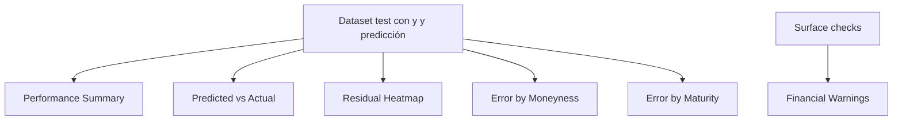

# Pestaña Diagnosis

La pestaña de diagnóstico resume la calidad predictiva del modelo y localiza regiones de error. Su foco no es explicar por qué una feature importa, sino dónde el modelo funciona mejor o peor.

## Performance Summary

La caja `Performance Summary` muestra métricas agregadas sobre el conjunto de test:

\[
MAE = \frac{1}{n}\sum_i |y_i-\hat{y}_i|
\]

donde:

- $MAE$ es el error absoluto medio.
- $n$ es el número de observaciones.
- $y_i$ es el valor real observado.
- $\hat{y}_i$ es la predicción del modelo para la observación $i$.

\[
RMSE = \sqrt{\frac{1}{n}\sum_i (y_i-\hat{y}_i)^2}
\]

donde:

- $RMSE$ es la raíz del error cuadrático medio.
- $n$ es el número de observaciones.
- $y_i$ es el valor real observado.
- $\hat{y}_i$ es la predicción del modelo para la observación $i$.

\[
R^2 = 1-\frac{\sum_i (y_i-\hat{y}_i)^2}{\sum_i (y_i-\bar{y})^2}
\]

donde:

- $R^2$ es el coeficiente de determinación.
- $y_i$ es el valor real observado.
- $\hat{y}_i$ es la predicción del modelo.
- $\bar{y}$ es la media de los valores reales.

Es el resumen más compacto de calidad final. RMSE es especialmente sensible a errores grandes, mientras que MAE representa error medio típico.

## Predicted vs Actual

El scatter compara volatilidad real contra volatilidad predicha. La diagonal representa predicción perfecta:

\[
\hat{y}=y
\]

donde:

- $\hat{y}$ es la predicción del modelo.
- $y$ es el valor real observado.
- La igualdad representa la diagonal de predicción perfecta.

Lecturas importantes:

- Nube pegada a diagonal: buena calibración general.
- Pendiente menor que 1: compresión de volatilidades extremas.
- Sesgo por zonas: errores sistemáticos para volatilidades altas o bajas.
- Puntos alejados: casos que merecen inspección local.

## Residual Heatmap

El heatmap de residuos agrega error absoluto por regiones de moneyness y vencimiento:

\[
AE_i = |y_i-\hat{y}_i|
\]

donde:

- $AE_i$ o $AbsoluteError_i$ es el error absoluto de la observación $i$.
- $y_i$ es el valor real observado.
- $\hat{y}_i$ es la predicción del modelo.
- $Residual_i$ es el residuo de la observación $i$.

Permite detectar si el modelo falla más en:

- Corto plazo.
- Largo plazo.
- ATM.
- Alas ITM/OTM.
- Combinaciones específicas de moneyness y maturity.

Esta vista es más informativa que una métrica global cuando el error no está distribuido uniformemente por la superficie.

## Error by Moneyness

Esta caja muestra patrones de residual frente a moneyness. Ayuda a ver si el modelo subestima o sobreestima volatilidad en regiones centrales o extremas.

La moneyness considerada en dashboard es:

\[
m=\frac{F}{K}
\]

donde:

- $m$ es la moneyness.
- $F$ es el precio del futuro subyacente.
- $K$ es el strike.

y también se usan transformaciones logarítmicas en artefactos relacionados. Errores concentrados lejos de $m=1$ suelen indicar dificultad en las alas.

## Error by Maturity

Esta caja muestra error frente a tiempo hasta vencimiento. Es esencial porque los vencimientos cortos suelen ser más sensibles a microestructura y a pequeños desfases temporales, mientras que vencimientos largos pueden tener menos observaciones o dinámicas distintas.

La lectura busca:

- Error creciente en corto plazo.
- Error creciente en largo plazo.
- Zonas con cambio brusco de sesgo.
- Diferencias entre regiones líquidas e ilíquidas.

## Financial Warnings

La caja `Financial Warnings` resume avisos derivados de checks sobre superficies locales. No reemplaza una validación completa de arbitraje, pero alerta sobre patrones que pueden ser económicamente dudosos:

- Saltos abruptos de smile.
- Cambios discontinuos por vencimiento.
- Superficies locales con comportamiento irregular.

Estos avisos ayudan a priorizar revisión manual incluso cuando las métricas agregadas parecen buenas.

