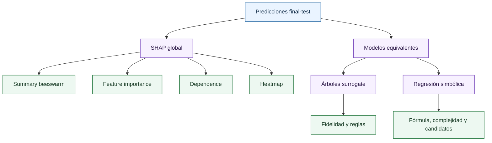

# Pestaña Global Explainability

Esta página es el mapa de lectura de la pestaña de explicabilidad global. La explicación detallada de cada concepto está separada en páginas específicas para que la documentación pueda leerse de forma rigurosa: [fundamentos de SHAP](global/shap-fundamentals.md), [visualizaciones SHAP](global/shap-visualizations.md), [Árboles surrogate](global/surrogate-trees.md) y [regresión simbólica](global/symbolic-regression.md).

La pestaña combina dos enfoques. El primero es atributivo: [SHAP](global/shap-fundamentals.md) descompone predicciones en contribuciones por variable. El segundo es aproximativo: los [Árboles surrogate](global/surrogate-trees.md) y la [regresión simbólica](global/symbolic-regression.md) construyen modelos interpretables que imitan al modelo principal.

## SHAP Explainability

[SHAP](global/shap-fundamentals.md) se usa porque permite comparar modelos heterogéneos bajo una misma semántica de atribución. El proyecto emplea `shap.Explainer` con algoritmo de permutación, adecuado para tratar el estimador como caja negra y explicar familias tan distintas como XGBoost, Random Forest o redes neuronales.

Las contribuciones cumplen:

\[
\hat{\sigma}_i = \phi_0 + \sum_j \phi_{ij}
\]

donde:

- $\hat{\sigma}$ o $f(x)$ es la predicción del modelo.
- $\phi_0$ es el valor base del explicador.
- $\phi_j$ es la contribución SHAP de la feature $j$.
- $p$ es el número de features explicadas.

En esta pestaña se agregan varias filas explicadas para estudiar comportamiento global. La interpretación local de una fila concreta se desarrolla en [SHAP local y waterfall](sample/local-shap-waterfall.md).

## Visualizaciones disponibles

| Caja | Página de detalle | Función |
| --- | --- | --- |
| `Summary` | [Visualizaciones SHAP](global/shap-visualizations.md) | Beeswarm de contribuciones individuales. |
| `Feature Importance` | [Visualizaciones SHAP](global/shap-visualizations.md) | Ranking por $\frac{1}{n}\sum_i|\phi_{ij}|$. |
| `Dependence` | [Visualizaciones SHAP](global/shap-visualizations.md) | Relación entre valor de feature y contribución. |
| `Heatmap` | [Visualizaciones SHAP](global/shap-visualizations.md) | Matriz de perfiles explicativos por observación. |
| `Surrogate trees` | [Árboles surrogate](global/surrogate-trees.md) | Reglas aproximadas del modelo principal. |
| `Symbolic model` | [Regresión simbólica](global/symbolic-regression.md) | Fórmula cerrada que aproxima al predictor. |

## Modelos equivalentes

Los modelos equivalentes no sustituyen al modelo principal. Su target es la predicción del modelo principal:

\[
\hat{\sigma}_{principal}(x) \approx h(x)
\]

donde:

- $\hat{\sigma}_{principal}(x)$ es la predicción del modelo principal.
- $g$ o $h$ es el modelo interpretable aproximador.
- $x$ es el vector de entrada explicado.

donde $h$ puede ser un árbol o una expresión simbólica. La calidad de esa aproximación se llama fidelidad. Una fidelidad alta indica que la explicación equivalente reproduce al modelo; no indica por sí sola que el modelo sea correcto frente al mercado.

## Lectura recomendada

Para defender un resultado ante revisión técnica:

1. Leer el ranking [SHAP](global/shap-fundamentals.md) para identificar drivers principales.
2. Usar dependence plots para comprobar dirección y no linealidad.
3. Revisar [Árboles surrogate](global/surrogate-trees.md) de baja profundidad para reglas globales.
4. Revisar [regresión simbólica](global/symbolic-regression.md) para una fórmula compacta y sus métricas.
5. Contrastar con [ICE](behaviour/ice.md), [ALE](behaviour/ale.md) y diagnóstico si aparecen patrones dudosos.

