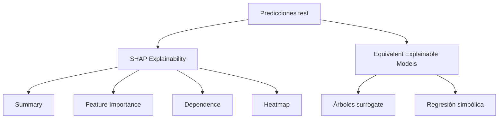

# Pestaña Global Explainability

Esta pestaña explica el modelo en conjunto. Combina SHAP global con modelos equivalentes más simples. Su objetivo es responder: ¿qué variables usa el modelo y con qué patrones generales?

## SHAP Explainability

La sección SHAP agrupa las visualizaciones basadas en valores de Shapley aproximados por permutación. La idea es descomponer cada predicción en contribuciones por feature:

$$
\hat{\sigma}_i = \phi_0 + \sum_j \phi_{ij}
$$

Valores positivos elevan la volatilidad predicha frente al baseline; valores negativos la reducen.

## Summary

La caja `Summary` muestra un beeswarm SHAP. Cada punto es una observación y cada fila una feature. La posición horizontal es la contribución SHAP, y el color suele representar el valor de la feature.

Se usa para leer:

- Ranking visual de importancia.
- Dirección del efecto.
- Dispersión de contribuciones.
- No linealidades y asimetrías.

## Feature Importance

La caja `Feature Importance` resume:

$$
I_j = \frac{1}{n}\sum_i |\phi_{ij}|
$$

Es una importancia global por magnitud media absoluta. A diferencia de coeficientes lineales, no indica signo; indica cuanto mueve cada feature la predicción en promedio.

## Dependence

La caja `Dependence` permite seleccionar una feature transformada y ver su valor frente a su contribución SHAP. Es útil para detectar:

- Umbrales.
- Saturaciones.
- Cambios de pendiente.
- Interacciones visibles por color o dispersión.

La lectura es local-global: cada punto es local, pero el patrón agregado revela la forma funcional aprendida.

## Heatmap

La caja `Heatmap` muestra contribuciones SHAP por observación y feature. Permite detectar grupos de observaciones con estructura explicativa parecida.

Por ejemplo, dos regiones de moneyness pueden tener volatilidades similares pero apoyarse en drivers distintos. El heatmap ayuda a distinguir esos regímenes.

## Equivalent Explainable Models

Esta sección contiene modelos sustitutos que aproximan al modelo principal. No explican la verdad de mercado directamente; explican el comportamiento del modelo entrenado.

### Árboles surrogate

Los árboles se entrenan a varias profundidades. Profundidades bajas dan reglas fáciles de leer pero menor fidelidad. Profundidades altas capturan más detalle, pero pueden dejar de ser interpretables.

El dashboard muestra:

- Profundidades disponibles.
- Reglas del árbol.
- Importancias del surrogate.
- Métricas de fidelidad contra el modelo principal.
- Imagen o representación del árbol.

### Regresión simbólica

La regresión simbólica produce una ecuación cerrada. Su valor es resumir una aproximación del modelo en una fórmula:

$$
\hat{\sigma}_{simbólica}=g(x_1,\ldots,x_p)
$$

El dashboard muestra la ecuación, complejidad, features usadas, métricas de fidelidad y candidatos alternativos. Una fórmula sencilla con fidelidad razonable es valiosa porque convierte un modelo complejo en una explicación comunicable.

