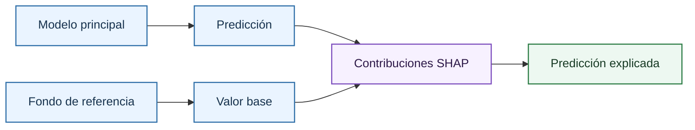

# Fundamentos de SHAP

[SHAP](shap-fundamentals.md) es el marco de explicabilidad usado en el proyecto para atribuir una predicción de volatilidad implícita a las variables visibles del dashboard: `OptionType`, `StrikePrice`, `UnderlyingPrice`, `TimeToExpiration` y `Rate`. La idea es descomponer una predicción individual en un valor base y una suma de contribuciones por feature.

## Descomposición aditiva

La explicación SHAP tiene forma aditiva:

\[
f(x)=\phi_0+\sum_{j=1}^{p}\phi_j(x)
\]

donde:

- $f(x)$ es la predicción del modelo principal para la muestra $x$.
- $\phi_0$ es el valor base definido por el fondo del explicador.
- $\phi_j(x)$ es la contribución atribuida a la feature $j$ para la muestra $x$.
- $p$ es el número total de features explicadas.

Una contribución positiva aumenta la volatilidad predicha respecto al valor base; una contribución negativa la reduce. Esta atribución no implica causalidad: explica el comportamiento del modelo entrenado bajo una referencia concreta.

## Valores de Shapley

SHAP se basa en los valores de Shapley de teoría de juegos cooperativos. En ese marco, las features son jugadores y la predicción es el pago a repartir. La atribución de una feature es su contribución marginal media al incorporarse a todos los posibles subconjuntos de features.

\[
\phi_j =
\sum_{S \subseteq N \setminus \{j\}}
\frac{|S|!(p-|S|-1)!}{p!}
\left[
v(S \cup \{j\})-v(S)
\right]
\]

donde:

- $N$ es el conjunto completo de features.
- $S$ es un subconjunto de features que no contiene la feature $j$.
- $p$ es el número total de features.
- $v(S)$ es el valor esperado del modelo cuando se conocen las features de $S$.
- $\phi_j$ es la atribución de Shapley asignada a la feature $j$.

Esta definición aporta eficiencia, simetría, tratamiento nulo de features irrelevantes y consistencia aditiva. Por eso resulta más defendible que una importancia global sin descomposición local.

## Aproximación por permutación

El repositorio usa `shap.Explainer(..., algorithm="permutation")`. Esta variante trata el modelo como caja negra, por lo que sirve para [regresión lineal](../../models/families/linear-regression.md), [Random Forest](../../models/families/random-forest.md), [XGBoost](../../models/families/xgboost.md), [redes neuronales](../../models/families/neural-networks.md) y [Quantum Inspired](../../models/families/quantum-inspired.md) con una interfaz común.

El presupuesto de evaluación por fila es:

\[
max\_evals = 2p+1
\]

donde:

- $max\\_evals$ es el número máximo de evaluaciones del modelo por explicación.
- $p$ es el número de features de explicabilidad.

El fondo se toma de una muestra controlada por `shap_background_size`; las filas explicadas globalmente por `shap_explain_size`; y las filas locales por `sample_option_size`.

## Variables raw y fidelidad

Las explicaciones se calculan sobre variables raw visibles. Es decir, las variables raw son aquellas que vienen directas de [`VOLATILITY_DB`](../../data/volatility.md), antes de hacer el feature engineering y sacar las [Features Derivadas](../../models/features.md). Esto mejora la lectura financiera: si `StrikePrice` tiene una contribución alta, el lector ve el efecto agregado del strike como input financiero, aunque internamente el modelo use transformaciones como `logMoneyness` o `logForwardMoneyness`.

Esta capa se reconstruye mediante `ExplainabilityEncoder`: el explicador perturba variables raw, el encoder reconstruye un raw frame válido y el runtime vuelve a generar las features del modelo antes de predecir.

## Referencias

- Shapley, L. S. (1953). *A Value for n-Person Games*. Contributions to the Theory of Games.
- Lundberg, S. M. y Lee, S.-I. (2017). *A Unified Approach to Interpreting Model Predictions*. NeurIPS.
- Molnar, C. (2022). *Interpretable Machine Learning*.

