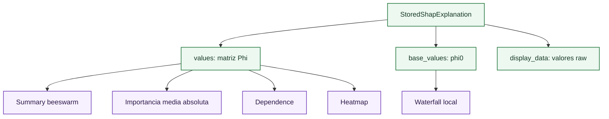

# Visualizaciones SHAP

Esta página describe cómo leer las visualizaciones basadas en [SHAP](shap-fundamentals.md) que aparecen en la pestaña [Global Explainability](../global-explainability.md). Todas comparten la misma base: una matriz de contribuciones $\Phi \in \mathbb{R}^{n \times p}$, donde cada fila corresponde a una observación explicada y cada columna a una feature de explicabilidad.

El objetivo de estas visualizaciones no es repetir una métrica de error, sino inspeccionar cómo razona el modelo. Dos modelos con RMSE parecido pueden usar drivers distintos, producir contribuciones locales más inestables o depender de variables que no tienen una interpretación financiera razonable.

## Summary beeswarm

El beeswarm ordena features por importancia global y muestra una nube de contribuciones individuales. Cada punto representa una observación. La posición horizontal es $\phi_j(x_i)$; el color representa el valor observado de la feature cuando la librería puede mostrarlo de forma interpretable.

La lectura técnica se apoya en cuatro patrones:

| Patrón | Lectura |
| --- | --- |
| Nube muy ancha | La feature cambia mucho la predicción en algunas observaciones. |
| Color ordenado de izquierda a derecha | Relación aproximadamente monótona entre valor de feature y contribución. |
| Colores mezclados | Interacciones o relación no monótona. |
| Colas aisladas | Casos extremos que conviene revisar con [SHAP local](../sample/local-shap-waterfall.md) y vecinos. |

En volatilidad implícita, una feature puede ser importante aunque no tenga un signo único. Por ejemplo, `StrikePrice` puede elevar o reducir la predicción dependiendo del nivel del subyacente y del vencimiento. En ese caso, lo relevante no es buscar un coeficiente global, sino identificar regímenes.

## Importancia media absoluta

La importancia global que se muestra en barras se calcula como:

\[
I_j = \frac{1}{n}\sum_{i=1}^{n}|\phi_j(x_i)|
\]

donde:

- $I_j$ es la importancia global de la feature $j$.
- $n$ es el número de observaciones explicadas.
- $\phi_j(x_i)$ es la contribución SHAP de la feature $j$ en la observación $i$.
- $x_i$ es la observación explicada.

Esta magnitud mide cuánto desplaza una feature la predicción en promedio, sin conservar el signo. Es adecuada para ranking, pero no para concluir dirección. Una feature con efectos positivos y negativos fuertes puede tener importancia alta aunque su efecto medio firmado sea cercano a cero.

La diferencia con la importancia de árboles es relevante. La importancia de impureza de un Random Forest depende de splits internos del propio estimador; la importancia [SHAP](shap-fundamentals.md) se calcula sobre el modelo ya entrenado y conserva la semántica de atribución aditiva. Esto permite comparar XGBoost, redes y lineal bajo la misma medida visual.

## Dependence plot

El dependence plot dibuja el valor de una feature frente a su contribución [SHAP](shap-fundamentals.md):

\[
x_{ij} \longmapsto \phi_j(x_i)
\]

donde:

- $x_{ij}$ es el valor de la feature $j$ en la observación $i$.
- $\phi_j(x_i)$ es la contribución SHAP asociada a esa feature y observación.

No es una curva de respuesta pura. Es una proyección de contribuciones locales. Por eso puede mostrar dispersión vertical: dos observaciones con el mismo valor de feature pueden tener contribuciones distintas si el modelo usa interacciones con vencimiento, moneyness, tipo o subyacente.

Para interpretar un dependence plot en este proyecto:

- Si la nube es suave y estrecha, el modelo usa la feature de forma estable.
- Si la nube tiene bandas, puede haber interacción con `OptionType` o con regiones discretas de vencimiento.
- Si hay saltos bruscos, conviene comprobar la [superficie de volatilidad](../behaviour/volatility-surfaces.md) para descartar comportamiento no suave.
- Si la dispersión aumenta en extremos, los vecinos locales pueden revelar si esa zona está poco soportada por datos históricos.

## Heatmap de contribuciones

El heatmap organiza observaciones y features como una matriz. La utilidad principal es detectar perfiles explicativos. En una superficie de volatilidad, dos contratos pueden recibir volatilidad parecida por razones distintas: uno puede estar explicado por vencimiento corto y otro por moneyness extrema.

El heatmap permite ver:

| Uso | Qué buscar |
| --- | --- |
| Segmentación | Bloques de filas con contribuciones parecidas. |
| Regímenes | Cambios de signo sistemáticos por feature. |
| Observaciones singulares | Filas con una feature dominante. |
| Redundancia | Features que actúan siempre de forma muy parecida. |

Una lectura rigurosa combina el heatmap con el dataset. Si un bloque explicativo coincide con vencimientos cortos o con zonas de moneyness alejadas de ATM, la interpretación tiene una base financiera. Si el bloque coincide con un artefacto de codificación o con un rango de escasos datos, debe tratarse como advertencia.

## Coherencia entre visualizaciones

Las visualizaciones [SHAP](shap-fundamentals.md) deben leerse en conjunto:

Si `TimeToExpiration` aparece como importante en barras, el dependence plot debe mostrar cómo varían sus contribuciones. Si además el heatmap revela un bloque de vencimientos cortos y el diagnóstico muestra mayor error en corto plazo, hay una historia técnica coherente. Si las visualizaciones se contradicen, la documentación del resultado debe reflejar la incertidumbre y no forzar una conclusión.

## Referencias

- Lundberg, S. M. y Lee, S.-I. (2017). *A Unified Approach to Interpreting Model Predictions*. NeurIPS.
- Molnar, C. (2022). *Interpretable Machine Learning*. Secciones de Shapley values e interpretabilidad global.
- Hastie, T., Tibshirani, R. y Friedman, J. (2009). *The Elements of Statistical Learning*. Referencia general para modelos aditivos, árboles y análisis de modelos supervisados.

