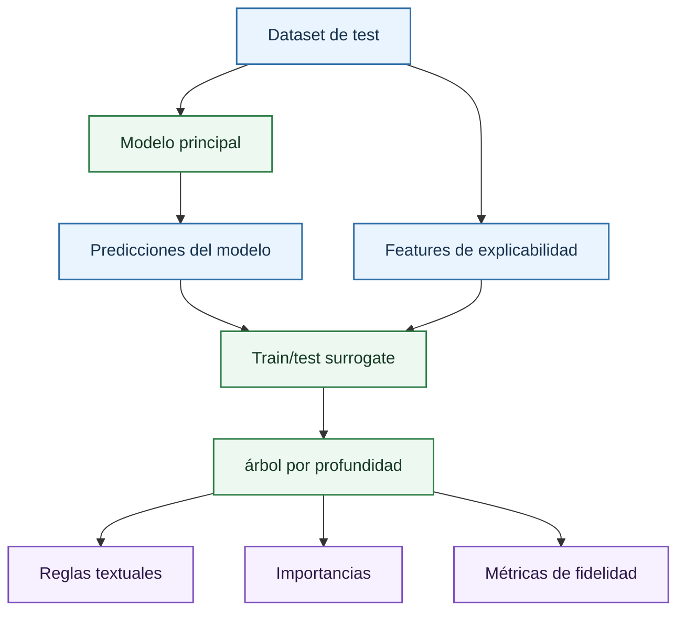

# Árboles surrogate

Un árbol surrogate es un modelo interpretable entrenado para imitar al modelo principal. En el proyecto no se entrena contra la volatilidad real, sino contra las predicciones finales del estimador seleccionado:

\[
\hat{\sigma}_{principal}(x) \longrightarrow \hat{\sigma}_{surrogate}(x)
\]

donde:

- $\hat{\sigma}_{principal}(x)$ es la predicción del modelo principal para la muestra $x$.
- $\hat{\sigma}_{surrogate}(x)$ es la predicción del árbol surrogate para la misma muestra.
- $x$ es el vector de features de explicabilidad usado para entrenar el surrogate.

Por tanto, el árbol surrogate explica el comportamiento del modelo, no la verdad de mercado. Esta distinción es fundamental. Si el modelo principal tiene sesgos, el surrogate puede aproximar esos sesgos con reglas legibles. Su utilidad está en convertir una caja negra en una estructura de decisiones aproximada que se pueda revisar, no en demostrar que esas reglas sean leyes financieras.

## Implementación en el repositorio

La función `build_surrogate_tree_models` construye los surrogates. El flujo es:

1. Se genera un `explainability_frame` con las features raw visibles.
2. Se codifican variables numéricas y categóricas mediante `ExplainabilityEncoder`.
3. Se muestrea un máximo de `surrogate_sample_size` filas.
4. Se separa un 20% para medir fidelidad.
5. Para cada profundidad configurada en `surrogate_depths`, se entrena un `DecisionTreeRegressor`.

Los parámetros actuales relevantes son:

| Parámetro | Valor en `resources/dashboard_models_config.json` | Efecto |
| --- | ---: | --- |
| `surrogate_depths` | 2, 4, 8, 16 | Controla el máximo de niveles del árbol. |
| `surrogate_min_samples_leaf` | 80 | Evita reglas basadas en hojas demasiado pequeñas. |
| `surrogate_sample_size` | 12000 | Limita el coste y estabiliza la muestra de imitación. |
| `random_state` | 42 | Reproducibilidad del muestreo y split. |

## Profundidad e interpretabilidad

La profundidad máxima es el control principal de complejidad. Un árbol de profundidad 2 puede leerse como un pequeño conjunto de reglas globales. Un árbol de profundidad 16 puede acercarse mejor al modelo principal, pero puede ser demasiado grande para una lectura humana completa.

La relación esperada es:

| Profundidad | Ventaja | Riesgo |
| ---: | --- | --- |
| 2 | Reglas muy claras; útil para resumen ejecutivo técnico. | Puede perder curvatura y regímenes locales. |
| 4 | Buen equilibrio inicial entre fidelidad y lectura. | Puede ocultar interacciones finas. |
| 8 | Captura más detalle de la superficie. | Empieza a ser difícil de auditar manualmente. |
| 16 | Alta capacidad de imitación. | Riesgo de explicar con demasiadas reglas, perdiendo interpretabilidad. |

En la documentación del resultado conviene justificar qué profundidad se usa para discusión. Si la profundidad 2 tiene RMSE de fidelidad bajo, las reglas globales son especialmente valiosas. Si solo profundidades altas consiguen fidelidad aceptable, el modelo principal probablemente utiliza interacciones complejas y no debe resumirse con pocas reglas.

## Métricas de fidelidad

La fidelidad se evalúa comparando predicción del surrogate contra predicción del modelo principal:

\[
RMSE_{fid} =
\sqrt{
\frac{1}{n}\sum_{i=1}^{n}
\left(
\hat{\sigma}_{principal}(x_i)
-
\hat{\sigma}_{surrogate}(x_i)
\right)^2
}
\]

donde:

- $RMSE$ es el error cuadrático medio de fidelidad.
- $n$ es el número de observaciones de evaluación.
- $\hat{\sigma}_{principal}(x_i)$ es la predicción del modelo principal.
- $\hat{\sigma}_{surrogate}(x_i)$ o $g(x_i)$ es la predicción del modelo explicable.

También se guardan MAE y $R^2$ cuando están configurados. Estas métricas no son métricas de mercado. Un surrogate puede tener excelente fidelidad a un modelo malo, y un surrogate con peor fidelidad puede seguir ser útil como resumen parcial. Por eso se debe presentar junto con las métricas de diagnóstico del modelo principal.

## Reglas textuales

El árbol se exporta con `export_text`, usando los nombres de features de explicabilidad. Una regla tiene forma:

\[
si\ x_j \leq c \quad entonces\ continuar\ por\ rama\ izquierda
\]

donde:

- $x_j$ es el valor de la feature usada en el nodo del árbol.
- $c$ es el umbral aprendido por el árbol.

En el caso de variables categóricas codificadas, las reglas deben interpretarse con cautela. `OptionType` se codifica numéricamente según niveles observados por el encoder; no debe leerse como una magnitud continua real. Para explicar opción call/put con precisión, conviene comprobar el mapeo de niveles en el bundle o contrastar la regla con observaciones filtradas.

## Uso en el tribunal

Los árboles surrogate son útiles para contestar preguntas como:

- Qué variable separa primero el espacio predictivo del modelo.
- Qué condiciones producen volatilidades altas o bajas según el modelo.
- Si el modelo está usando moneyness y vencimiento antes que variables menos justificables.
- Si una familia compleja puede resumirse con reglas simples sin perder demasiada fidelidad.

Su lectura debe presentarse como aproximación. La frase correcta no es "el mercado sigue estas reglas", sino "el modelo entrenado puede aproximarse mediante estas reglas con la fidelidad indicada".

## Referencias

- Craven, M. y Shavlik, J. W. (1996). *Extracting Tree-Structured Representations of Trained Networks*. NeurIPS.
- Molnar, C. (2022). *Interpretable Machine Learning*. Capítulo de global surrogate models.
- Breiman, L., Friedman, J. H., Olshen, R. A. y Stone, C. J. (1984). *Classification and Regression Trees*.

