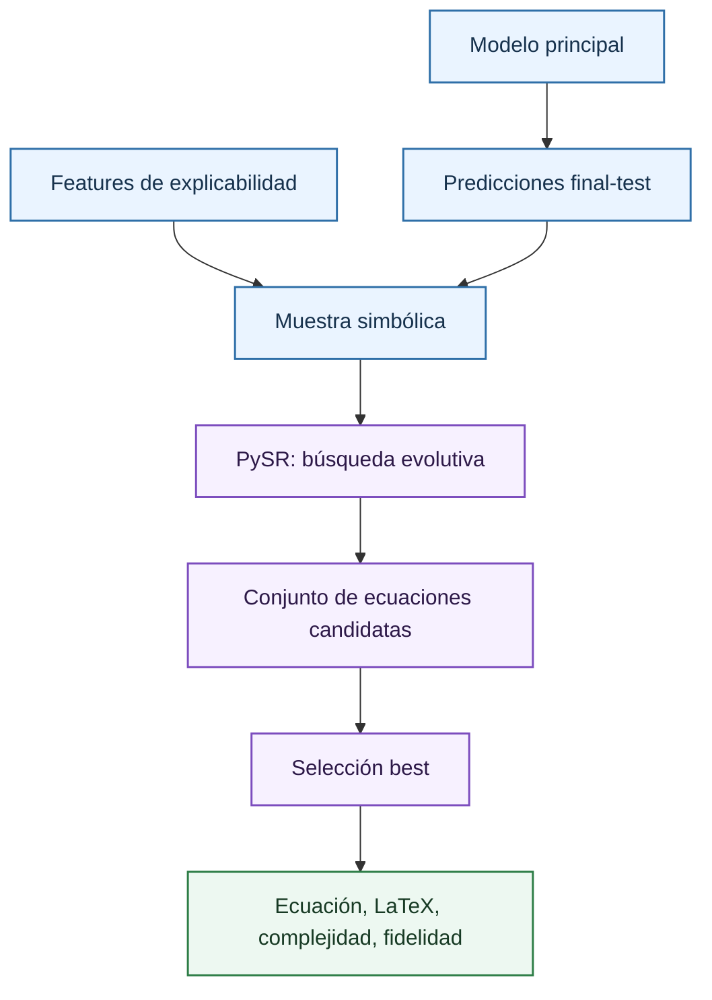

# Regresión simbólica

La regresión simbólica busca una expresión matemática cerrada que aproxime una relación observada. En este proyecto se usa como modelo surrogate: la expresión no se ajusta directamente a la volatilidad implícita real, sino a las predicciones del modelo principal sobre una muestra del dataset de test.

La forma objetivo es:

\[
\hat{\sigma}_{principal}(x) \approx g(x_1,\ldots,x_p)
\]

donde:

- $\hat{\sigma}_{principal}(x)$ es la predicción del modelo principal.
- $g$ o $h$ es el modelo interpretable aproximador.
- $x$ es el vector de entrada explicado.

donde $g$ es una fórmula formada por variables, constantes y operadores permitidos. Su valor en la documentación es claro: proporciona una aproximación algebraica del comportamiento del modelo, con una complejidad explícita y métricas de fidelidad. Es especialmente útil cuando el tribunal quiere entender si una red o un boosting está aprendiendo una relación interpretable o si depende de interacciones demasiado complejas para resumirse.

## Qué problema resuelve

La regresión lineal ofrece una fórmula, pero puede ser demasiado rígida. Un Random Forest, XGBoost o una red neuronal pueden aproximar superficies no lineales, pero no producen una ecuación directamente legible. La regresión simbólica ocupa un punto intermedio: busca fórmulas no lineales con operadores simples, penalizando implícita o explícitamente la complejidad.

En el contexto de volatilidad implícita, una ecuación simbólica puede revelar estructuras como:

- Dependencia con vencimiento.
- Curvatura respecto a strike o subyacente.
- Interacción entre precio relativo y tipo.
- Correcciones no lineales que el modelo principal usa de forma recurrente.

La ecuación no debe presentarse como fórmula de valoración de opciones. Es una aproximación del predictor entrenado. Esa diferencia evita confundir una explicación empírica con un modelo financiero cerrado.

## Método usado: PySR y búsqueda evolutiva

El repositorio usa `PySRRegressor`, una interfaz Python para SymbolicRegression.jl. El método no es reinforcement learning ni un algoritmo de enjambre. Es una búsqueda evolutiva de expresiones: se mantienen poblaciones de fórmulas candidatas que se modifican mediante operaciones inspiradas en algoritmos genéticos, se evalúan por error y complejidad, y se seleccionan candidatas prometedoras.

Conceptualmente:

Las expresiones se comparan por su pérdida sobre datos de entrenamiento y por su complejidad estructural. PySR conserva una tabla de ecuaciones candidatas, no solo la mejor fórmula final. Esto es importante para auditoría: una ecuación ligeramente peor pero mucho más simple puede ser más defendible como explicación.

## Configuración concreta

La función `build_symbolic_regressor_model` configura PySR con:

| Parámetro | Valor actual | Interpretación |
| --- | ---: | --- |
| `symbolic_sample_size` | 2500 | Número máximo de observaciones usadas para ajustar el surrogate simbólico. |
| `test_size` | 0.2 | Parte reservada para medir fidelidad fuera del ajuste simbólico. |
| `niterations` | 120000 | Número de iteraciones evolutivas. Aumentarlo amplía la búsqueda. |
| `populations` | 12 | Número de poblaciones paralelas de expresiones. |
| `population_size` | 80 | Tamaño de cada población. |
| `topn` | 48 | Número de expresiones destacadas que se conservan internamente. |
| `ncycles_per_iteration` | 1200 | Trabajo evolutivo por iteración. |
| `maxsize` | 80 | Tamaño máximo permitido de la expresión. |
| `maxdepth` | 24 | Profundidad máxima del árbol de expresión. |
| `timeout_in_seconds` | 3600 | Límite temporal de búsqueda. |
| `batching` | `True` | Evalúa por lotes para reducir coste. |
| `batch_size` | `min(256, len(X_train))` | Tamaño de lote usado por PySR. |
| `precision` | 32 | Precisión numérica de cálculo. |

Los operadores permitidos son:

| Tipo | Operadores | Consecuencia |
| --- | --- | --- |
| Binarios | `+`, `-`, `*`, `/`, `^` | Permiten suma, interacción multiplicativa, ratios y potencias. |
| Unarios | `square`, `cube` | Permiten curvatura cuadrática y cúbica. |
| Restricción | `^`: `(-1, 1)` | Limita complejidad de exponentes en potencias. |

La selección usa `model_selection="best"`, que elige una ecuación equilibrando pérdida y complejidad según el criterio interno de PySR. El bundle conserva también `candidate_equations`, con al menos `symbolic_min_candidate_equations` fórmulas normalizadas cuando están disponibles.

## Complejidad

La complejidad es una medida estructural de la expresión. Aumenta con variables, constantes y operadores. No equivale a número de parámetros en sentido estadístico clásico, pero funciona como proxy de legibilidad.

Una fórmula con complejidad baja puede ser:

\[
g(x)=a+b\cdot TimeToExpiration
\]

donde:

- $g(x)$ es la expresión simbólica candidata.
- $a$ es el término constante.
- $b$ es el coeficiente de la variable.
- `TimeToExpiration` es el tiempo hasta vencimiento usado por la expresión.

Una fórmula de complejidad alta puede incluir múltiples productos, cocientes y potencias. Aunque tenga menor error de fidelidad, puede dejar de ser útil como explicación si exige demasiado esfuerzo para interpretarla. En documentación técnica, la ecuación elegida debe presentarse siempre junto con:

- Complejidad.
- Features usadas.
- RMSE/MAE/$R^2$ de fidelidad.
- Tabla de candidatas alternativas.

## Fidelidad y uso correcto

La fidelidad se calcula sobre el 20% reservado:

\[
RMSE_{sym} =
\sqrt{
\frac{1}{n}\sum_i
\left(
\hat{\sigma}_{principal}(x_i)-g(x_i)
\right)^2
}
\]

donde:

- $RMSE_{sym}$ es el error cuadrático medio de fidelidad de la expresión simbólica.
- $n$ es el número de observaciones del conjunto reservado.
- $\hat{\sigma}_{principal}(x_i)$ es la predicción del modelo principal.
- $g(x_i)$ es la predicción de la fórmula simbólica.

Un RMSE bajo indica que la ecuación reproduce bien al modelo principal en la muestra evaluada. No garantiza buen comportamiento fuera de distribución, ni validez financiera universal. La ecuación simbólica debe usarse como resumen interpretable, no como sustituto operativo salvo validación adicional.

## Por qué es útil en este TFM

La regresión simbólica aporta una pieza que otros métodos no dan:

| Método | Qué explica | Qué no aporta |
| --- | --- | --- |
| [SHAP](shap-fundamentals.md) | Atribución local y ranking global. | No produce una fórmula compacta. |
| [árbol surrogate](surrogate-trees.md) | Reglas por umbrales. | Puede ser discontinuo y grande. |
| Regresión simbólica | Fórmula algebraica aproximada. | Puede perder fidelidad o extrapolar mal. |

Para un tribunal, la ecuación simbólica permite discutir si el comportamiento aprendido puede reducirse a una relación matemática razonable. Si la fórmula seleccionada usa `StrikePrice`, `UnderlyingPrice` y `TimeToExpiration` de forma coherente con la geometría de la superficie, refuerza la interpretabilidad del pipeline. Si la fórmula necesita mucha complejidad, esa conclusión también es informativa: el modelo principal no se deja resumir fácilmente.

## Referencias

- Cranmer, M. (2023). *Interpretable Machine Learning for Science with PySR and SymbolicRegression.jl*. arXiv.
- Schmidt, M. y Lipson, H. (2009). *Distilling Free-Form Natural Laws from Experimental Data*. Science.
- Koza, J. R. (1992). *Genetic Programming: On the Programming of Computers by Means of Natural Selection*.
- La Cava, W., Orzechowski, P., Burlacu, B. et al. (2021). *Contemporary Symbolic Regression Methods and their Relative Performance*. NeurIPS Datasets and Benchmarks.

