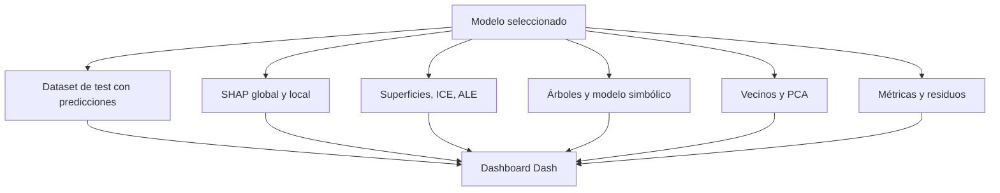
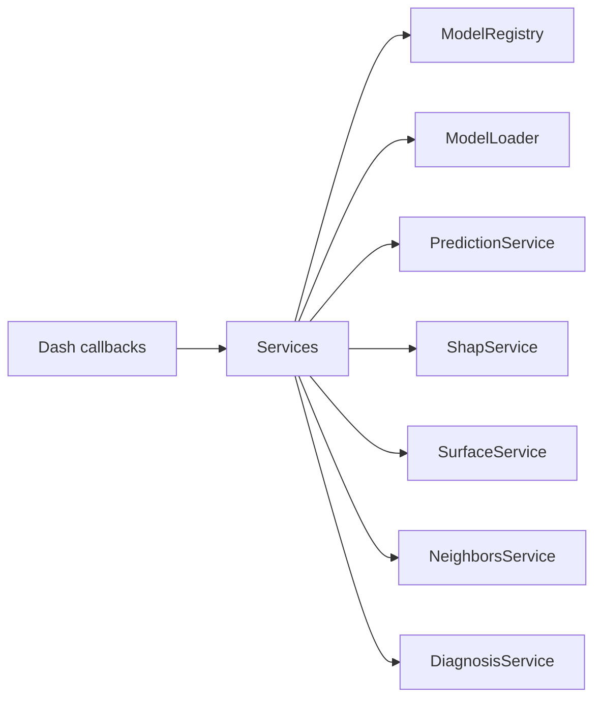

# Dashboard: cometido

El dashboard es la capa de inspección del proyecto. No entrena modelos; consume bundles explicables generados a partir de modelos entrenados y permite analizar su comportamiento desde cuatro perspectivas:

- Comportamiento de la superficie: cómo cambia la volatilidad ante perturbaciones financieras.
- Explicabilidad global: qué variables dominan el modelo en conjunto.
- Explicabilidad local: por qué se obtiene una predicción concreta.
- Diagnóstico: dónde acierta y dónde falla el modelo.

## Selector de modelo

Antes de las pestañas hay una zona común con:

- Selector de modelo.
- Botón de refresco.
- Panel de información del modelo.

El selector descubre bundles disponibles en `src/dashboard/saved_models` o en el backend configurado. El panel de información resume metadatos: features de entrada, features transformadas, rutas de artefactos, métricas finales, profundidades de surrogates disponibles y datos de entrenamiento relevantes. La conversión desde un modelo entrenado se describe en [De modelo entrenado a bundle visualizable](model-to-dashboard.md).

## Arquitectura de servicios

El dashboard crea un contenedor de servicios al arrancar. Ese contenedor separa:

| Servicio conceptual | Responsabilidad |
| --- | --- |
| Storage runtime | Resolver si los bundles vienen de local o GCP. |
| Registro de modelos | Descubrir bundles disponibles. |
| Loader de modelos | Cargar bundles con cache. |
| Proveedor de datos | Entregar datasets ya materializados. |
| Predicción | Ejecutar modelo principal o usar predicciones precomputadas. |
| SHAP | Servir explicaciones globales/locales almacenadas. |
| Superficies | Construir o recuperar superficies, ICE y ALE. |
| Vecinos | Recuperar observaciones históricas cercanas. |
| Diagnóstico | Exponer métricas, residuos y warnings. |

## Pestanas

| Pestaña | Pregunta principal |
| --- | --- |
| [Behaviour And Surface](behaviour-surface.md) | Cómo responde el modelo ante cambios de mercado. |
| [Global Explainability](global-explainability.md) | Qué patrones globales explican las predicciones. |
| [Sample Explainability](sample-explainability.md) | Por qué se predice una muestra concreta. |
| [Diagnosis](diagnosis.md) | Dónde se concentran errores y advertencias. |

Cada pestaña está documentada en su propia página con una sección por cada caja visual.

