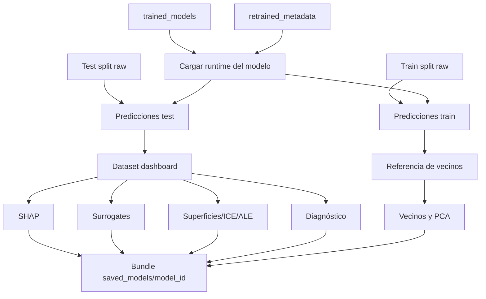

# De modelo entrenado a bundle visualizable

El paquete de conversión toma modelos guardados tras el reentrenamiento final y genera un bundle autocontenido. Ese bundle es lo que consume el [dashboard](index.md). La conversión no cambia el modelo principal; calcula artefactos auxiliares que permiten explicarlo sin repetir procesos costosos en cada interacción.

## Descubrimiento y carga del runtime

La conversión descubre familias entrenadas en la carpeta de modelos finales. Para cada familia:

- Localiza el fichero del estimador.
- Localiza metadatos de final test.
- Localiza metadatos train/val si existen.
- Carga scaler cuando el modelo lo necesita.
- Fuerza predicción en proceso único cuando el estimador permite paralelismo, para evitar conflictos en runtime.

## Dataset de dashboard

El dataset de dashboard se construye sobre el split de test. Contiene columnas raw, features transformadas, predicción, residual y error absoluto:

$$
Residual_i = y_i-\hat{y}_i
$$

$$
AbsoluteError_i = |Residual_i|
$$

El split de train se conserva como referencia para vecinos. Esta separación es deliberada:

- Diagnóstico y visualizaciones de rendimiento se hacen sobre test.
- Vecinos se buscan contra train, para dar contexto histórico sin usar el mismo conjunto evaluado como referencia principal.

## SHAP

Se calculan explicaciones SHAP mediante un explainer de permutación:

- Un fondo pequeño muestreado del dataset.
- Una muestra global para beeswarm, barras y heatmap.
- Una muestra local para waterfalls.

La explicación aproxima la descomposición:

$$
\hat{f}(x)=\phi_0+\sum_{j=1}^{p}\phi_j(x)
$$

donde \(\phi_0\) es el valor base y \(\phi_j\) la contribución de cada feature.

## Árboles surrogate

Para varias profundidades configuradas se entrena un árbol que imita las predicciones del modelo principal sobre una muestra. Su objetivo no es sustituir al modelo, sino mostrar reglas aproximadas. La fidelidad se mide comparando:

$$
\hat{\sigma}_{modelo} \quad \text{vs} \quad \hat{\sigma}_{árbol}
$$

Se guardan métricas, importancias, reglas textuales, número de hojas y profundidad efectiva.

## Regresión simbólica

La regresión simbólica busca una expresión cerrada que aproxime el modelo principal. El proceso explora ecuaciones con operadores aritméticos y selecciona una expresión que equilibra error y complejidad.

El bundle guarda:

- Ecuación seleccionada.
- Expresión en LaTeX.
- Features usadas.
- Complejidad.
- Tabla de ecuaciones candidatas.
- Fidelidad frente al modelo principal.

## Superficies, ICE y ALE

Las superficies se generan alrededor de anclas representativas del test. Para cada ancla se construye una grilla de moneyness y vencimiento, manteniendo el resto de variables fijas.

ICE e ALE se calculan para features de análisis:

- Strike.
- Subyacente.
- Tiempo a vencimiento.
- Tipo de interés.

ICE muestra respuestas individuales. ALE muestra efecto acumulado centrado por bins, más robusto cuando hay correlaciones entre variables.

## Vecinos

Los vecinos se calculan contra el split de train transformado. Se estandarizan features y se recuperan observaciones más cercanas. También se guarda una proyección PCA para representar distancias en 3D.

## Estructura del bundle

Cada carpeta de modelo contiene:

- `metadata.json` raíz.
- Carpeta `dashboard_model/`.
- Dataset de test con predicciones.
- Referencia de train para vecinos.
- SHAP global/local.
- Frames de vecinos, superficies, ICE y ALE.
- Diagnóstico.
- Árboles surrogate.
- Modelo simbólico.
- Stub de respuesta manual.

El dashboard puede arrancar sin recalcular estos artefactos, lo que reduce tiempo de respuesta.

