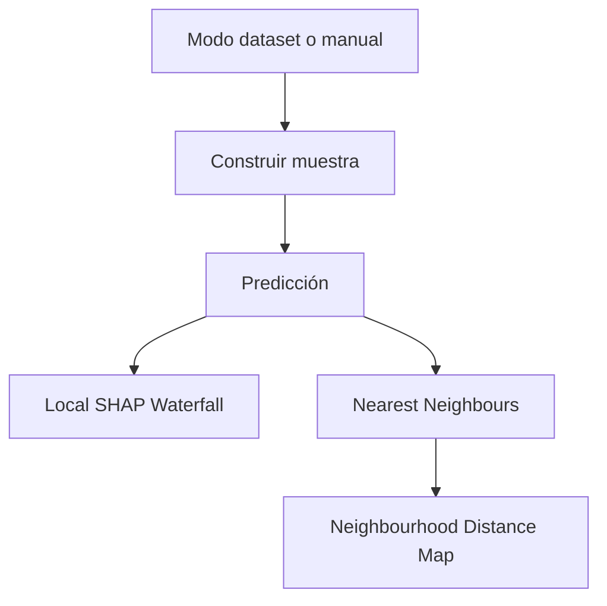
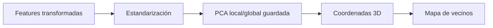

# Pestaña Sample Explainability

Esta pestaña analiza una observación concreta. Puede partir de una fila del dataset o de una entrada manual. Su objetivo es responder: ¿por qué esta muestra recibe esta volatilidad predicha y qué observaciones históricas se le parecen?

## Mode

La caja `Mode` permite elegir entre:

- Dataset sample: una observación ya presente en el bundle.
- Manual input: una muestra definida por el usuario con las features raw visibles.

La entrada manual usa las mismas variables financieras que el modelo espera conceptualmente: tipo de opción, strike, subyacente, tiempo a vencimiento y tipo.

## Dataset Sample

Cuando el modo es dataset, el usuario selecciona el índice de una observación precomputada. Esto permite usar SHAP local y vecinos ya guardados en el bundle, con respuesta rápida.

## Feature Preview

La vista previa muestra los valores relevantes de la muestra seleccionada o manual. Sirve para comprobar que la explicación que se va a lanzar corresponde al escenario financiero deseado.

## Manual Form

En modo manual, el formulario recoge los inputs raw. El dashboard normaliza y valida esos valores según el esquema de features:

- Numéricos con rango válido cuando aplica.
- Tipo de opción dentro de categorías permitidas.
- Defaults razonables para columnas auxiliares no visibles.

## Analyze Sample

El botón ejecuta el análisis. En muestra de dataset, recupera artefactos del bundle. En muestra manual, puede usar el runtime/API para calcular predicción, SHAP local y vecinos.

## Sample Output

La caja de salida resume la predicción:

$$
\hat{\sigma}=f(x)
$$

Si existe volatilidad real asociada, también puede interpretarse junto al residual:

$$
e = \sigma - \hat{\sigma}
$$

## Local SHAP Waterfall

El waterfall local descompone una predicción:

$$
\hat{\sigma}(x)=\phi_0+\phi_1(x)+\cdots+\phi_p(x)
$$

La visualización ordena contribuciones por magnitud. Permite ver qué variables empujan la volatilidad hacia arriba o hacia abajo para esa muestra específica.

Interpretación:

- Barras positivas: aumentan la volatilidad frente al baseline.
- Barras negativas: reducen la volatilidad frente al baseline.
- La suma de baseline y contribuciones llega a la predicción.

## Nearest Neighbours

La tabla de vecinos muestra observaciones históricas cercanas en el espacio de features del modelo. La distancia se calcula tras estandarizar variables, para que ninguna feature domine solo por escala.

La utilidad es doble:

- Validar soporte local: una muestra rodeada de vecinos parecidos es más fiable.
- Comparar predicción frente a casos históricos: ayuda a detectar muestras manuales fuera de distribución.

## Neighbourhood Distance Map

El mapa 3D proyecta la muestra y sus vecinos a componentes principales. No pretende que cada eje tenga una interpretación fija; es una visualización local de proximidad.

Si la muestra aparece aislada, la explicación local debe leerse con más cautela. Si aparece dentro de una nube densa de vecinos, la predicción tiene más soporte empírico.

