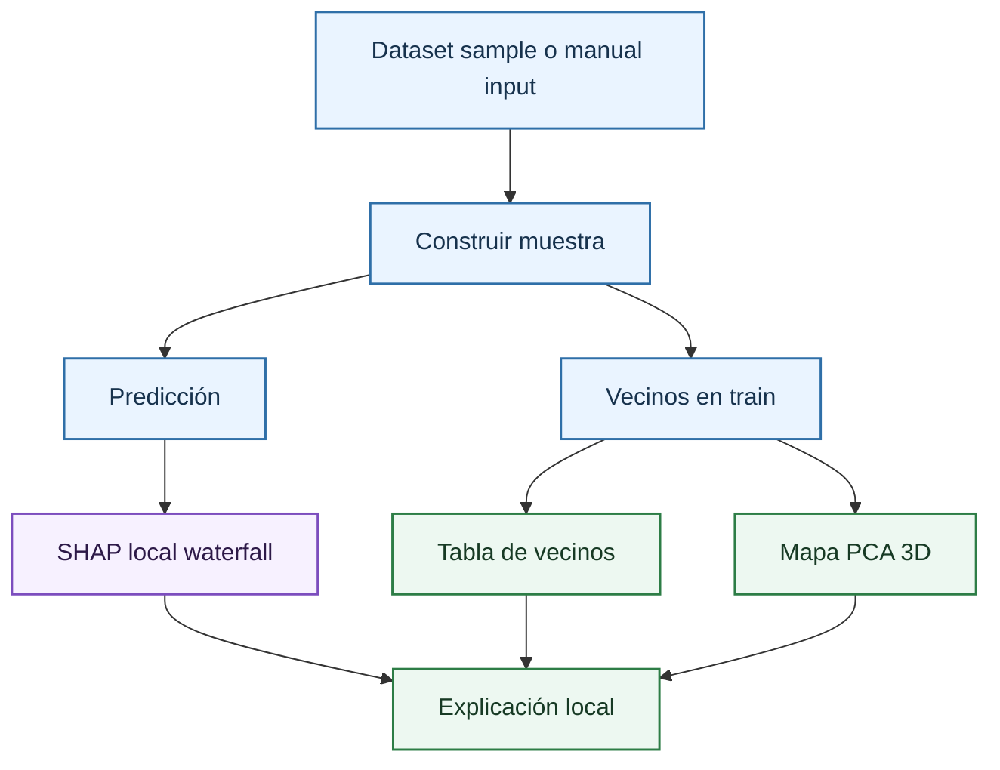

# Pestaña Sample Explainability

Esta página resume la pestaña de explicabilidad local. El detalle está dividido en [SHAP local y waterfall](sample/local-shap-waterfall.md) y [vecinos y soporte local](sample/neighbours.md).

La pestaña responde a dos preguntas:

- Por qué una muestra concreta recibe una volatilidad predicha.
- Si esa muestra está respaldada por observaciones históricas similares.

## Mode

El modo `Dataset sample` selecciona una observación del bundle con artefactos precomputados. El modo `Manual input` permite introducir un escenario financiero. En ambos casos se usan las mismas variables raw visibles: `OptionType`, `StrikePrice`, `UnderlyingPrice`, `TimeToExpiration` y `Rate`.

## Feature Preview y Manual Form

La vista previa sirve para comprobar que la muestra explicada corresponde al contrato deseado. En modo manual, el formulario valida rangos y categorías mediante el esquema de features del dashboard.

## Sample Output

La salida resume:

\[
\hat{\sigma}=f(x)
\]

donde:

- $\hat{\sigma}$ es la volatilidad implícita predicha.
- $f$ es el modelo entrenado.
- $X$ o las variables entre paréntesis son las entradas financieras del modelo.

Si la observación pertenece al dataset y existe volatilidad real, también puede leerse el residual:

\[
e=\sigma-\hat{\sigma}
\]

donde:

- Los símbolos de la fórmula se definen en el contexto técnico inmediatamente anterior.

El residual evalúa acierto frente a mercado. El [waterfall SHAP](sample/local-shap-waterfall.md) explica la predicción del modelo.

## Local SHAP Waterfall

El waterfall local usa [SHAP](global/shap-fundamentals.md) para construir:

\[
\hat{\sigma}(x)=\phi_0+\phi_1(x)+\cdots+\phi_p(x)
\]

donde:

- $\hat{\sigma}$ o $f(x)$ es la predicción del modelo.
- $\phi_0$ es el valor base del explicador.
- $\phi_j$ es la contribución SHAP de la feature $j$.
- $p$ es el número de features explicadas.

La lectura completa está en [SHAP local y waterfall](sample/local-shap-waterfall.md).

## Nearest Neighbours

Los vecinos muestran observaciones históricas cercanas en el espacio transformado del modelo. La utilidad es evaluar soporte local y detectar extrapolación. El cálculo y sus cautelas se documentan en [vecinos y soporte local](sample/neighbours.md).

