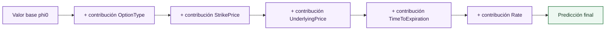

# SHAP local y waterfall

La explicación local responde a una pregunta distinta de la explicabilidad global: por qué una muestra concreta recibe una volatilidad predicha concreta. El dashboard usa [SHAP](../global/shap-fundamentals.md) local y una visualización waterfall para descomponer una predicción individual.

La identidad de lectura es:

\[
\hat{\sigma}(x_i)=\phi_0+\sum_{j=1}^{p}\phi_j(x_i)
\]

donde:

- $\hat{\sigma}(x)$ es la predicción del modelo.
- $\phi_0$ es el valor base del explicador.
- $\phi_j$ es la contribución SHAP de la feature $j$.
- $p$ es el número de features explicadas.

El waterfall ordena las contribuciones $\phi_j(x_i)$ y muestra cómo se avanza desde el valor base $\phi_0$ hasta la predicción final $\hat{\sigma}(x_i)$. Las contribuciones positivas empujan la volatilidad hacia arriba; las negativas la reducen.

## Muestras de dataset y muestras manuales

La pestaña [Sample Explainability](../sample-explainability.md) admite dos modos:

| Modo | Fuente | Explicación |
| --- | --- | --- |
| Dataset sample | Fila precomputada del split de test | Usa artefactos `local_shap` guardados en el bundle. |
| Manual input | Valores introducidos por el usuario | Puede llamar al runtime/API para predicción, [SHAP](../global/shap-fundamentals.md) local y vecinos. |

En ambos casos, la semántica es la misma: explicar la predicción del modelo principal. La diferencia está en el coste. Las muestras de dataset ya tienen contribuciones calculadas durante la generación del bundle. Las muestras manuales requieren construir el raw frame, normalizarlo, predecir y generar explicación en runtime.

## Valor base

El valor base no es una media universal del mercado. Es el valor esperado del modelo sobre el fondo usado por el explicador. Ese fondo se muestrea del dataset de test, obligando que para todas las gráficas SHAP ese fondo sea el mismo para que obtengamos siempre el mismo valor base. Por tanto, si se cambia el procedimiento de muestreo o el split, el baseline puede cambiar.

Esta precisión es importante al defender resultados. Una contribución local debe explicarse como "desplazamiento respecto al baseline del modelo bajo este fondo", no como prima absoluta de mercado atribuida a una variable.

## Lectura financiera

Una explicación local se interpreta mejor en tres pasos:

1. Revisar los valores de la muestra: tipo de opción, strike, subyacente, vencimiento y tipo.
2. Leer las contribuciones dominantes del waterfall.
3. Comprobar soporte local mediante [vecinos](neighbours.md) y error regional mediante diagnóstico.

Ejemplo de razonamiento correcto:

> La muestra tiene vencimiento corto y moneyness alejada de ATM. El waterfall muestra contribución positiva de `TimeToExpiration` o `StrikePrice`. La predicción está además rodeada de vecinos cercanos con volatilidades similares, por lo que la explicación tiene soporte local razonable.

Ejemplo de razonamiento insuficiente:

> `StrikePrice` es positivo, luego subir el strike causa más volatilidad.

La segunda frase confunde atribución predictiva con causalidad y omite que strike y subyacente interactúan a través de moneyness.

## Relación con predicción y residual

Cuando la muestra procede del dataset y tiene volatilidad real, puede compararse:

\[
e_i = \sigma_i - \hat{\sigma}(x_i)
\]

donde:

- Los símbolos de la fórmula se definen en el contexto técnico inmediatamente anterior.

El waterfall explica $\hat{\sigma}(x_i)$, no el residual. Si el residual es grande, el waterfall sigue siendo una explicación fiel del modelo, pero el modelo ha fallado respecto al dato observado. En ese caso, la pregunta cambia: no solo "por qué predijo esto", sino "por qué esta explicación no fue suficiente para acertar". Ahí entran la pestaña de diagnóstico y la comparación con vecinos.

## Referencias

- Lundberg, S. M. y Lee, S.-I. (2017). *A Unified Approach to Interpreting Model Predictions*. NeurIPS.
- Shapley, L. S. (1953). *A Value for n-Person Games*. Contributions to the Theory of Games.
- Molnar, C. (2022). *Interpretable Machine Learning*. Capítulo de Shapley values.

