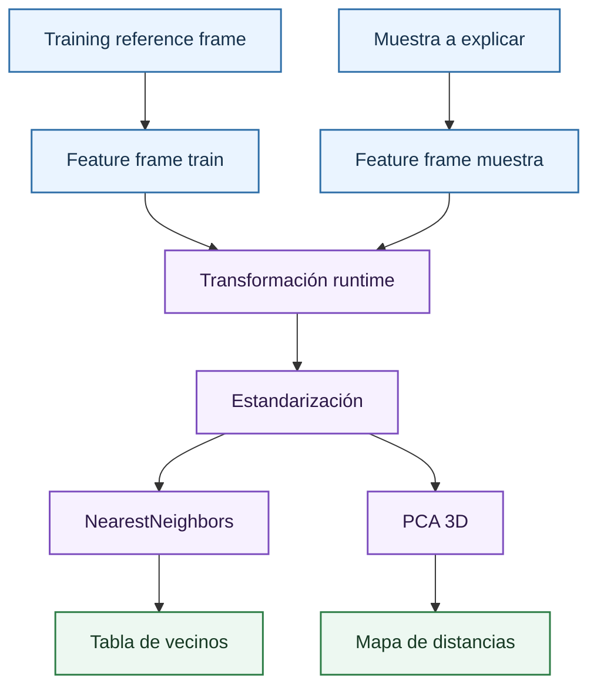
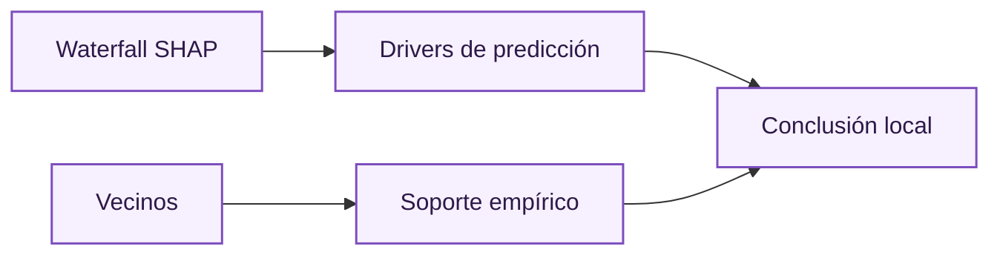

# Vecinos y soporte local

El análisis de vecinos mide si una muestra está cerca de observaciones históricas usadas como referencia. Es una herramienta de soporte empírico: no explica por sí sola qué feature causa una predicción, pero indica si el escenario que se está explicando pertenece a una región conocida del espacio de datos.

En el proyecto, los vecinos se calculan contra el split de train transformado. Esta decisión evita usar como referencia principal el mismo split de test que se está diagnosticando. El objetivo es contestar: dado un contrato o una entrada manual, qué casos históricos del entrenamiento se parecen más en el espacio de features del modelo.

## Cálculo de vecinos

La función `build_neighbors_frame`:

1. Muestrea hasta `neighbors_sample_size` observaciones del train reference frame.
2. Convierte train y muestra al feature frame transformado del modelo.
3. Aplica la transformación del runtime, incluido scaler si la familia lo requiere.
4. Estandariza columnas con `StandardScaler`.
5. Ajusta `NearestNeighbors`.
6. Recupera hasta `neighbors_k` vecinos por muestra.

Los parámetros actuales son:

| Parámetro | Valor | Efecto |
| --- | ---: | --- |
| `neighbors_sample_size` | 20000 | Tamaño máximo de la base de referencia. |
| `neighbors_k` | 200 | Número de vecinos guardados por muestra. |
| `neighbor_reference_split` | train | Split usado como referencia histórica. |

La distancia se calcula tras estandarización para que una variable con escala grande no domine por unidades. Esto es imprescindible porque las features pueden estar en días, precios, ratios o indicadores.

## Soporte local

Una muestra con vecinos cercanos tiene mayor soporte local. Esto no garantiza que la predicción sea correcta, pero reduce el riesgo de extrapolación. Por el contrario, una muestra aislada debe interpretarse con cautela: el modelo puede estar extrapolando a una región poco observada.

La lectura recomendada es:

| Situación | Interpretación |
| --- | --- |
| Distancias bajas y vecinos homogéneos | Escenario bien representado por el histórico. |
| Distancias bajas pero volatilidades reales dispersas | Zona conocida pero ruidosa. |
| Distancias altas | Posible extrapolación. |
| Vecinos con moneyness/vencimiento muy distintos | La métrica de distancia puede no estar capturando la similitud financiera deseada. |

## Proyección PCA

El mapa 3D usa PCA para proyectar el entorno a tres componentes. PCA es una transformación lineal que busca direcciones de máxima varianza:

\[
Z = XW
\]

donde:

- $Z$ es la matriz proyectada en componentes principales.
- $X$ es la matriz estandarizada de features.
- $W$ contiene los vectores principales de PCA.

donde $W$ contiene los vectores principales. La proyección no pretende asignar significado financiero directo a cada eje. Sirve para visualizar proximidad relativa.

El bundle guarda:

- `feature_names`
- valores de relleno
- escalas usadas
- componentes
- varianza explicada

Si la muestra aparece dentro de una nube de vecinos, la explicación local tiene mejor soporte visual. Si aparece separada, conviene advertir que el resultado puede depender de extrapolación.

## Relación con SHAP local

[SHAP local](local-shap-waterfall.md) contesta qué variables empujan la predicción. Los vecinos contestan si hay observaciones parecidas. Juntas permiten una explicación más sólida:

Una explicación local sin vecinos puede ser matemáticamente correcta pero empíricamente frágil. Una tabla de vecinos sin waterfall muestra similitud, pero no atribuye la predicción. La combinación es lo que permite defender una predicción individual ante revisión.

## Referencias

- Cover, T. y Hart, P. (1967). *Nearest Neighbor Pattern Classification*. IEEE Transactions on Information Theory.
- Jolliffe, I. T. (2002). *Principal Component Analysis*. Springer.
- Molnar, C. (2022). *Interpretable Machine Learning*. Discusión sobre explicabilidad local y datos fuera de distribución.

