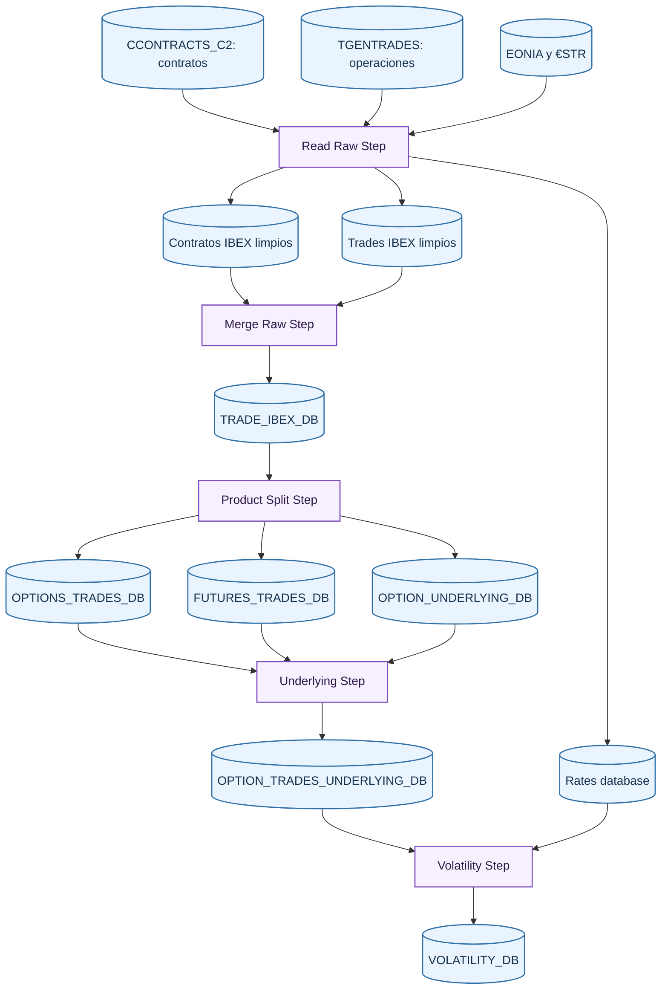
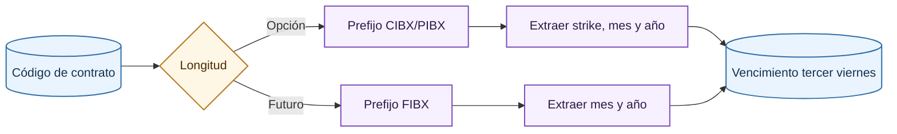

# Datos: visión general del ETL

El ETL transforma ficheros fuente de mercado y tipos en una base final de volatilidad implícita. La cadena está diseñada como una secuencia de pasos materializados. Cada paso tiene entradas claras, validaciones de calidad, transformaciones financieras y una salida persistida.

En estos diagramas, los nodos azules representan datasets o fuentes persistidas, mientras que los nodos morados representan procesos de transformación. El detalle de cada etapa está documentado en [Read Raw Step](raw-read.md), [Merge Raw Step](merge-raw.md), [Product Split Step](product-split.md), [Underlying Step](underlying.md) y [Volatility Step](volatility.md).

## Principios del pipeline

El pipeline sigue cuatro principios:

- Persistencia por paso: cada etapa escribe una base propia y la puede reutilizar si ya existe.
- Validación temprana: antes de construir una salida, el StepLoader valida que la entrada respeta el contrato esperado.
- Trazabilidad de esquemas: las columnas y tipos se definen en configuración y enums.
- Separación de mercado y modelado: el ETL termina cuando existe una volatilidad implícita fiable; el entrenamiento empieza después.

## Datos de partida

El proyecto parte de tres familias de datos:

| Fuente | Contenido | Uso |
| --- | --- | --- |
| Contratos | Información de contratos negociados, strike y vencimiento. | Enriquecer trades con características contractuales. |
| Operaciones | Operaciones ejecutadas, precio, cantidad, hora y contrato. | Base observacional de mercado. |
| Tipos | Series EONIA y €STR. | Calcular el tipo compuesto hasta vencimiento. |

Los datos fuente se filtran a contratos IBEX y vencimientos mensuales. Las opciones semanales o contratos fuera del dominio se descartan porque el proyecto modela opciones IBEX mensuales y futuros mensuales asociados.

## Contratos y codificación

La codificación de contrato es parte esencial del ETL. En la configuración se declaran:

- Prefijos de opciones call, opciones put y futuros.
- Longitud esperada de códigos de opciones y futuros.
- Posición de mes y año dentro del código.
- Posición del strike en opciones.
- Mapa entre letras de mes y número de mes.

Con esto se puede verificar que el vencimiento informado concuerda con el código, y también reconstruir vencimientos o strikes cuando una fuente no trae el campo completo. El vencimiento se asume en el tercer viernes del mes correspondiente, con hora de expiración configurada.

## Validaciones transversales

Aunque cada paso tiene validaciones específicas, hay controles recurrentes:

| Validación | Razón |
| --- | --- |
| Precios positivos | Una operación con precio no positivo no puede alimentar Black-76. |
| Cantidades positivas | Cantidades nulas o negativas no representan trades válidos. |
| Claves duplicadas | Evita ambigüedades en contratos y operaciones. |
| Missing values | Garantiza que la salida cumple su esquema. |
| Vencimiento coherente | Evita opciones ya vencidas o códigos mal interpretados. |
| Strike coherente | Asegura que la columna de strike coincide con el código. |
| Subyacente temporalmente anterior | Evita usar información posterior a la operación de opción. |

## Salida final

La base final `VOLATILITY_DB` contiene, a nivel conceptual:

- Fecha y hora de ejecución de la opción.
- Código de contrato de opción.
- Tipo call/put.
- Precio negociado de la opción.
- Strike.
- Futuro subyacente y precio asociado.
- Fecha y hora de ejecución del subyacente.
- Lag entre opción y subyacente.
- Tiempo a vencimiento.
- Tipo compuesto hasta vencimiento.
- Volatilidad implícita resuelta.

Esa base es la única entrada necesaria para generar datos de entrenamiento, explicados en la sección de [modelos de volatilidad](../models/index.md).

