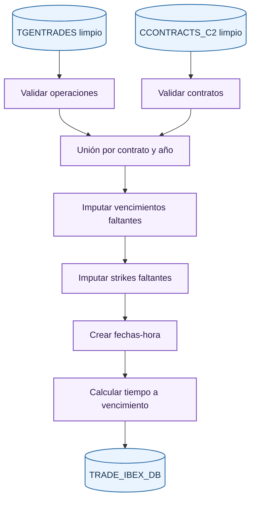
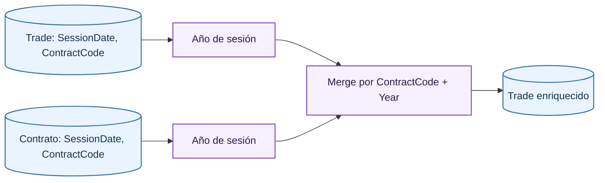

# Merge Raw Step

El segundo paso une operaciones con información contractual. La salida `TRADE_IBEX_DB` es la primera base donde cada trade tiene precio, cantidad, código de contrato, strike, vencimiento, tipo de contrato, fecha-hora de ejecución y tiempo hasta vencimiento.

## Validaciones de entrada

Las operaciones se validan antes de unir:

- Precio de trade estrictamente positivo.
- Cantidad estrictamente positiva.
- Identificador de ejecución único.
- Ausencia de missing values.

Los contratos se validan con criterios contractuales:

- Par `(SessionDate, ContractCode)` único.
- Mes de vencimiento coherente con la letra de mes del contrato.
- Año de vencimiento coherente con el código.
- Strike de opciones coherente con el substring del código.
- Missing values permitidos solo cuando el contrato es futuro y el strike no aplica.

## Unión por contrato y año

El merge se hace por código de contrato y año de sesión. Esta decisión reduce memoria frente a una unión diaria completa y aprovecha que la información contractual relevante se puede representar por contrato dentro del año. Después de unir, se agrega el tipo de contrato según la longitud del código.

## Imputación de vencimientos

Cuando falta el vencimiento, se reconstruye desde el código de contrato:

- En opciones, el año se interpreta como `20YY`.
- En futuros, el año se interpreta como el siguiente año compatible con el último dígito informado y la fecha de sesión.
- El día se calcula como tercer viernes del mes.

La regla de tercer viernes es:

$$
d_{3F} = 1 + ((4 - weekday(\text{primer día del mes})) \bmod 7) + 14
$$

Después se agrega la hora de expiración configurada, de forma que el vencimiento sea un datetime y no solo una fecha.

## Imputación de strikes

Para opciones con strike missing, el strike se extrae del código. La configuración declara el tramo de caracteres que codifica el strike. Para futuros, el strike no tiene significado económico y no se usa como strike de opción.

$$
K = \text{float}(c[\text{strike\_start}:\text{strike\_end}])
$$

## Tiempo hasta vencimiento

Se construye una fecha-hora de ejecución combinando fecha de sesión y hora de ejecución. Si la fuente no trae microsegundos, se normaliza con microsegundos cero. El tiempo hasta vencimiento se calcula en días con decimales:

$$
T_{días}=\frac{\text{MaturityDatetime}-\text{ExecDatetime}}{24\cdot 3600}
$$

## Salida

`TRADE_IBEX_DB` contiene operaciones de opciones y futuros juntas. Incluye una columna de tipo de contrato, por lo que el paso de [separación por producto](product-split.md) puede dividir el universo sin volver a interpretar los ficheros raw.

