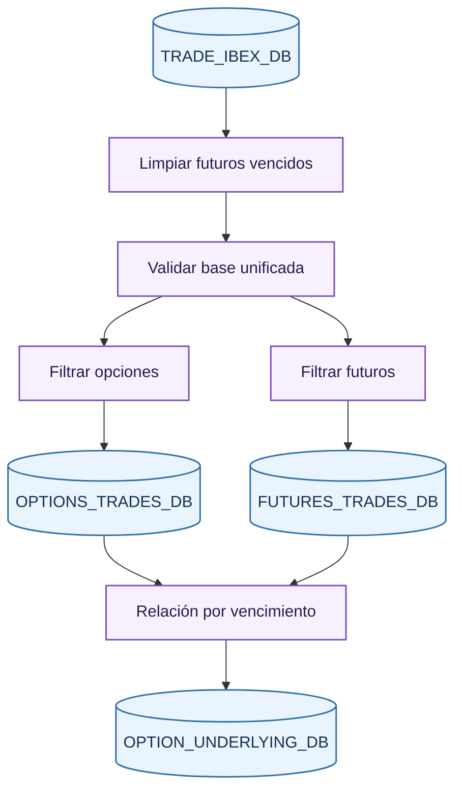
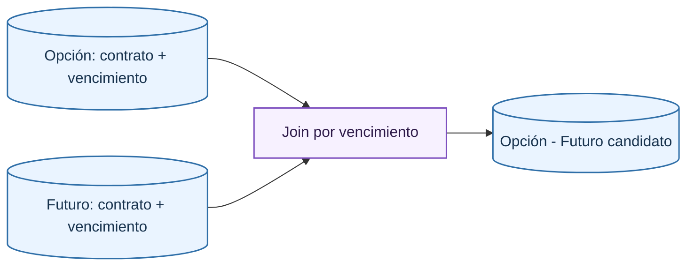

# Product Split Step

El tercer paso separa `TRADE_IBEX_DB` en operaciones de opciones, operaciones de futuros y una tabla de relación entre cada opción y los futuros que comparten vencimiento.

## Limpieza previa

Antes de validar la base, se eliminan futuros con tiempo a vencimiento negativo. Esta limpieza se limita a futuros, porque la base final se construirá con opciones y el objetivo aquí es no romper la relación opción-subyacente por futuros que ya no son candidatos válidos.

## Validaciones

La base unificada se valida de nuevo porque ahora todas las columnas calculadas deben existir:

- Precio y cantidad positivos.
- Tiempo a vencimiento no negativo.
- Vencimiento coherente con códigos de opciones y futuros.
- Fecha de sesión anterior o igual al vencimiento.
- Strike coherente para opciones.
- Missing values según el tipo de contrato.

Esta validación protege el paso posterior, donde se hace una unión temporal entre opciones y futuros. Si aquí entra un contrato con vencimiento incorrecto, podría asociarse a un subyacente equivocado.

## Separación de productos

La separación usa los prefijos declarados:

| Producto | Prefijos | Nueva clave |
| --- | --- | --- |
| Opciones | `CIBX`, `PIBX` | `OptionContractCode` |
| Futuros | `FIBX` | `FutureContractCode` |

Cada salida conserva solo las columnas de su esquema. El cambio de nombre de la columna de contrato evita ambigüedad cuando después se combinan operaciones de opción y futuro.

## Relación opción-subyacente

La relación `OPTION_UNDERLYING_DB` se construye uniendo opciones y futuros por vencimiento. Cada opción queda asociada a los futuros con la misma fecha de madurez.

El criterio económico es que las opciones sobre IBEX se valoran contra el futuro de vencimiento compatible. En esta fase aún no se elige una operación concreta del futuro; solo se identifica qué contrato de futuro es el subyacente del contrato de opción.

## Salidas

| Salida | Papel |
| --- | --- |
| `OPTIONS_TRADES_DB` | Operaciones de opciones con precio, strike, vencimiento y fecha-hora de ejecución. |
| `FUTURES_TRADES_DB` | Operaciones de futuros disponibles para servir como subyacente. |
| `OPTION_UNDERLYING_DB` | Mapeo contrato de opción a contrato de futuro por vencimiento. |

Estas tres bases alimentan el paso de [asignación del subyacente](underlying.md).

