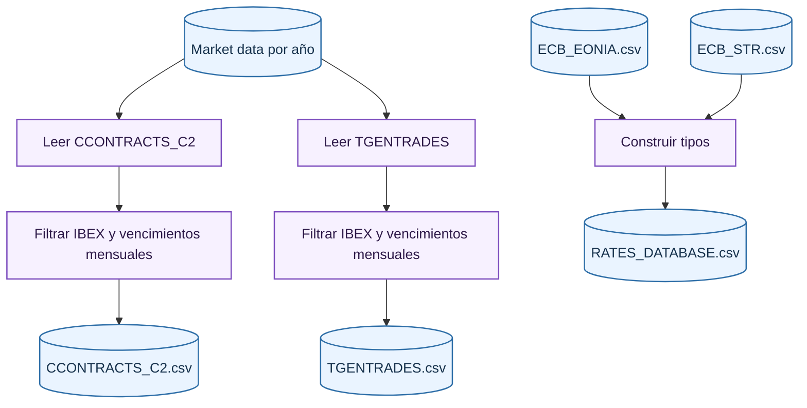
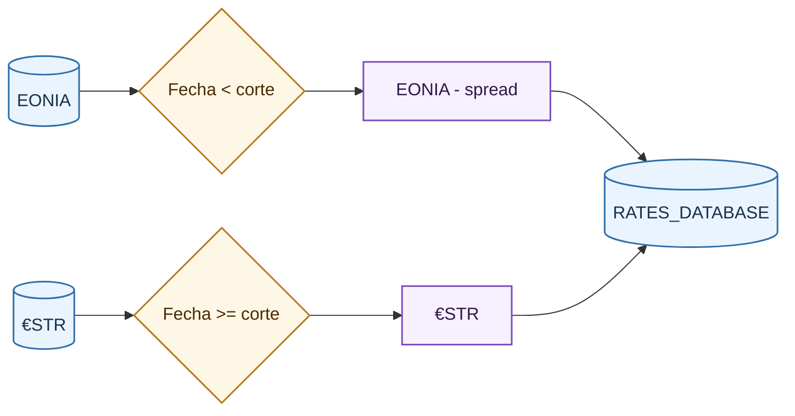

# Read Raw Step

El primer paso convierte ficheros fuente heterogéneos en tres bases limpias: contratos, operaciones y tipos. Su objetivo es reducir volumen, normalizar tipos y dejar solo el universo de instrumentos que el proyecto modela.

## Entradas

| Entrada | Descripción |
| --- | --- |
| Ficheros `CCONTRACTS_C2` | Descripción diaria de contratos: código, strike, vencimiento y metadatos. |
| Ficheros `TGENTRADES` | Operaciones ejecutadas: contrato, hora, precio, cantidad y tipo de operación. |
| `ECB_EONIA.csv` | Tipo EONIA histórico. |
| `ECB_STR.csv` | Tipo €STR histórico. |

El rango de años se toma de configuración. Para cada año se buscan ficheros con los prefijos esperados y extensiones de mercado. Cuando hay variantes repetidas para una misma fecha, se conserva un fichero único por fecha.

## Normalización de cabeceras y tipos

Los ficheros fuente pueden llegar con o sin cabecera. El loader detecta si la primera fila parece una cabecera textual y la descarta cuando corresponde. En el caso de operaciones puede aparecer una columna auxiliar de secuencia que no pertenece al esquema final; esa columna se elimina.

Después se asignan nombres de columnas según el schema declarado y se seleccionan solo columnas relevantes. Las conversiones de tipos cubren:

- Fechas de sesión.
- Horas de ejecución.
- Numéricos de precio, cantidad, strike y tipos.
- Texto para códigos y categorías.

## Filtrado de universo IBEX

El filtrado inicial aplica dos condiciones:

\[
\text{es_IBEX}(c)=c \text{ empieza por alguno de los prefijos configurados}
\]

donde:

- $c$ es el código de contrato.
- $\text{es_IBEX}(c)$ indica si el contrato pertenece al universo IBEX configurado.

\[
\text{es_mensual}(c)=\text{longitud}(c)\in\{\text{longitud opción},\text{longitud futuro}\}
\]

donde:

- $c$ es el código de contrato.
- $\text{es\_mensual}(c)$ indica si la longitud del contrato corresponde a vencimientos mensuales configurados.

Solo se conservan filas que cumplen ambas. Esto mantiene el universo consistente entre contratos y operaciones.

## Construcción de la base de tipos

La base de tipos combina EONIA y €STR. Antes de la fecha de corte se utiliza EONIA ajustado por el spread configurado; desde la fecha de corte se utiliza €STR directamente.

La lógica financiera es construir una serie continua de referencia monetaria. Para fechas antiguas, el ajuste aproxima la transición entre EONIA y €STR:

\[
r_t =
\begin{cases}
\text{EONIA}_t - s, & t < t_{\mathrm{corte}} \\
\text{€STR}_t, & t \ge t_{\mathrm{corte}}
\end{cases}
\]

donde:

- $r_t$ es el tipo usado en la fecha $t$.
- $s$ es el spread de ajuste entre EONIA y €STR.
- $t_{\mathrm{corte}}$ es la fecha de cambio de régimen de tipos.

## Validaciones y salidas

Este paso no realiza todavía las validaciones financieras profundas; su cometido principal es lectura, selección y tipado. Las salidas son:

| Salida | Contenido |
| --- | --- |
| `CCONTRACTS_C2.csv` | Contratos IBEX mensuales seleccionados y tipados. |
| `TGENTRADES.csv` | Operaciones IBEX mensuales seleccionadas y tipadas. |
| `RATES_DATABASE.csv` | Serie diaria de tipos de referencia homogénea. |

Estas tres bases alimentan el paso de [unión de operaciones y contratos](merge-raw.md).

