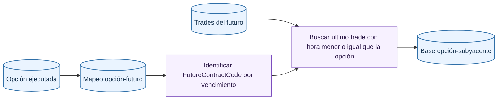
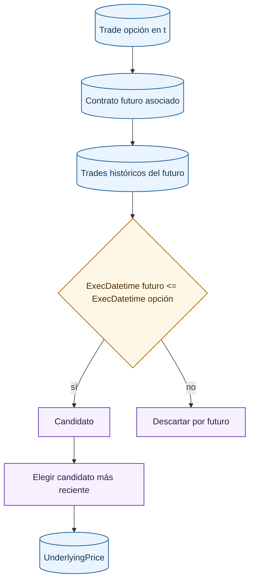

# Underlying Step

El cuarto paso asigna a cada operación de opción el precio del futuro subyacente más reciente disponible en el momento de la operación. Esta es una de las partes más importantes para evitar lookahead en el propio ETL.

## Entradas

| Entrada | Contenido |
| --- | --- |
| `OPTIONS_TRADES_DB` | Trades de opciones. |
| `FUTURES_TRADES_DB` | Trades de futuros. |
| `OPTION_UNDERLYING_DB` | Relación entre contrato de opción y contrato de futuro. |

## Validaciones de entrada

Se validan de nuevo opciones, futuros y candidatos de subyacente:

- Precios y cantidades positivos.
- Tiempo a vencimiento no negativo.
- Vencimiento coherente con código.
- Sesión no posterior al vencimiento.
- Strike coherente para opciones.
- Missing values controlados.
- Claves duplicadas en la relación opción-futuro.

## Unión temporal as-of

Primero se une cada trade de opción con su contrato de futuro candidato. Luego se ordenan las operaciones de opción y futuro por fecha-hora de ejecución. Para cada opción se selecciona el último trade del futuro con:

$$
t_{futuro} \le t_{opción}
$$

Este criterio evita usar información futura. La operación de futuro elegida puede ser de la misma sesión o anterior, pero nunca posterior a la opción.

## Lag del subyacente

La base calcula el lag entre opción y subyacente en minutos:

$$
Lag_{min}=\frac{\lvert t_{opción}-t_{subyacente}\rvert}{60}
$$

Aunque la unión as-of ya impone $t_{subyacente}\le t_{opción}$, se guarda el valor absoluto como magnitud de distancia temporal. Este campo permite filtrar operaciones cuyo precio de futuro sea demasiado antiguo en el paso de [volatilidad implícita](volatility.md).

## Salida

`OPTION_TRADES_UNDERLYING_DB` contiene:

- Contrato de opción.
- Contrato de futuro subyacente.
- Precio de opción.
- Precio de futuro usado como subyacente.
- Fecha-hora de opción.
- Fecha-hora de subyacente.
- Lag del subyacente.
- Strike, vencimiento, cantidad y metadatos.

Esta salida es la base directa para aplicar Black-76 en el [cálculo de volatilidad implícita](volatility.md).

