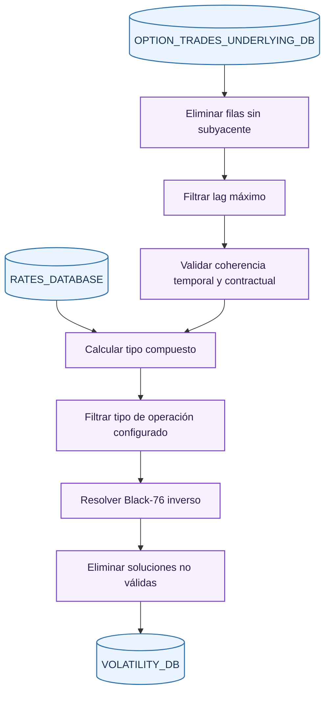
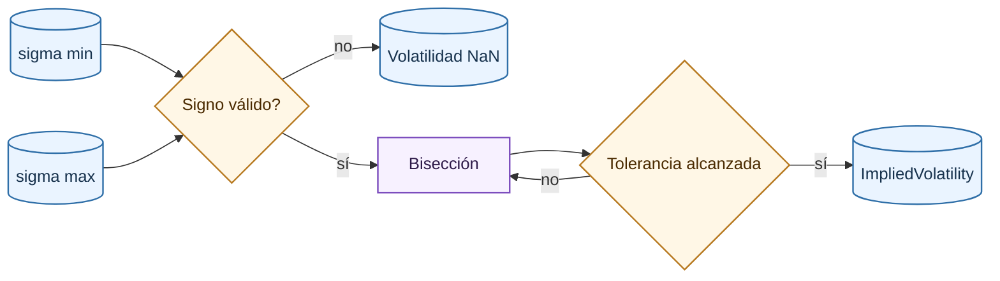

# Volatility Step

El último paso del ETL calcula la volatilidad implícita de cada operación de opción. Para ello limpia operaciones sin subyacente fiable, calcula el tipo compuesto hasta vencimiento y resuelve numéricamente la volatilidad que iguala Black-76 al precio observado.

## Limpieza de operaciones

Se descartan dos grupos de filas:

- Operaciones de opción sin contrato de futuro, precio de subyacente o fecha-hora de subyacente.
- Operaciones con lag de subyacente superior al umbral configurado.

El filtro de lag es necesario porque un precio de futuro demasiado antiguo puede no representar el estado de mercado en el momento de la opción. Sin este control, la volatilidad implícita podría absorber errores de sincronización.

## Validaciones

Antes de valorar se exige:

- Precio de opción, precio de subyacente, strike y cantidad estrictamente positivos.
- Ausencia de missing values.
- Strike y vencimiento coherentes con el código de opción.
- Fecha-hora del subyacente no posterior a la opción.
- Fecha-hora del subyacente no fuera del rango permitido de la sesión.
- Tiempo a vencimiento no negativo.
- Serie de tipos sin missing values.

## Tipo compuesto hasta vencimiento

El tipo usado por Black-76 se calcula como un tipo compuesto desde la fecha de ejecución hasta vencimiento. Para períodos de al menos un día, se recorren días hábiles y se acumula:

\[
\prod_i \left(1 + r_i \frac{n_i}{N}\right)
\]

donde:

- $r_i$ es el tipo diario en decimal.
- $n_i$ es el número de días cubiertos por el tipo $i$.
- $N$ es la base anual de cómputo, configurada como 360.

donde $N=360$, $r_i$ es el tipo diario en decimal y $n_i$ es el número de días naturales cubiertos por ese tipo. Los lunes cubren tres días para recoger el fin de semana.

El tipo anualizado equivalente es:

\[
r_{comp} = \left(\prod_i \left(1 + r_i \frac{n_i}{N}\right)-1\right)\frac{N}{d_c}
\]

donde:

- $r_i$ es el tipo diario en decimal.
- $n_i$ es el número de días cubiertos por el tipo $i$.
- $N$ es la base anual de cómputo, configurada como 360.

donde $d_c$ es el número de días naturales hasta vencimiento. Para vencimientos intradía se aplica una conversión proporcional con el tipo overnight disponible para evitar explosiones numéricas en vencimientos muy cortos.

## Fórmula Black-76

El modelo Black-76 valora opciones sobre forwards/futuros. Para una call:

\[
C=e^{-rT}\left(FN(d_1)-KN(d_2)\right)
\]

Para una put:

\[
P=e^{-rT}\left(KN(-d_2)-FN(-d_1)\right)
\]

con:

\[
d_1=\frac{\ln(F/K)+\frac{1}{2}\sigma^2T}{\sigma\sqrt{T}},
\qquad
d_2=d_1-\sigma\sqrt{T}
\]

donde:

- $C$ es el precio teórico de una call.
- $P$ es el precio teórico de una put.
- $F$ es el futuro subyacente.
- $K$ es el strike.
- $T$ es el vencimiento en años.
- $r$ es el tipo compuesto.
- $\sigma$ es la volatilidad implícita que se quiere resolver.
- $N(\cdot)$ es la función de distribución normal estándar.

## Solver de volatilidad implícita

La volatilidad se obtiene buscando la raíz:

\[
g(\sigma)=P_{Black76}(F,K,T,r,\sigma)-P_{mercado}=0
\]

donde:

- $g(\sigma)$ es la función cuya raíz se busca.
- $P_{Black76}$ es el precio teórico Black-76.
- $P_{mercado}$ es el precio observado.
- $\sigma$ es la volatilidad implícita candidata.

El solver usa bisección entre los límites de volatilidad configurados. Si la función no cambia de signo o aparece un valor no finito, la fila se marca como no resoluble. Las filas sin solución dentro de los límites se eliminan antes de persistir la salida.

## Salida final

`VOLATILITY_DB` es la base final del ETL. Contiene las columnas necesarias para entrenamiento y para reconstruir explicaciones:

| Grupo | Columnas conceptuales |
| --- | --- |
| Identificación | fecha, contrato de opción, tipo de opción, trade id, mercado |
| Precio | precio de opción, precio de subyacente, strike, cantidad |
| Tiempo | vencimiento, ejecución, tiempo a vencimiento, ejecución del subyacente, lag |
| Valoración | tipo compuesto, contrato futuro, volatilidad implícita |

Esta tabla cierra el pipeline de datos y alimenta la [generación de features de modelos](../models/features.md).

