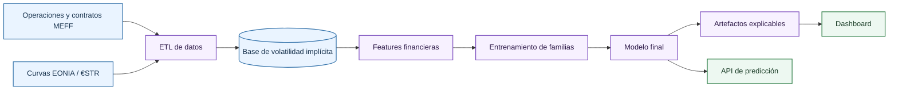
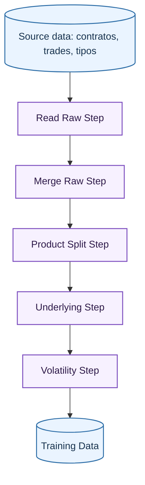

# Volatilidad explicable en opciones del IBEX

Este proyecto construye una cadena completa para estimar y explicar la volatilidad implícita de opciones sobre el IBEX. El problema central no es solo obtener un predictor preciso, sino convertirlo en una herramienta inspeccionable: dado un contrato, un precio de subyacente, un vencimiento y un tipo de interés, el sistema estima la volatilidad implícita y permite entender qué variables están sosteniendo esa predicción.

La motivación financiera es clara. La volatilidad implícita no se observa directamente en mercado; se infiere invirtiendo un modelo de valoración. En este caso la base construida parte de operaciones reales de opciones y futuros, enlaza cada opción con su futuro subyacente, calcula el tipo de interés aplicable hasta vencimiento y resuelve la volatilidad implícita compatible con el precio observado. A partir de esa base se entrenan familias de modelos de regresión con distintos grados de flexibilidad y explicabilidad.

## Problema que se quiere resolver

El objetivo es aproximar la función de volatilidad implícita:

$$
\hat{\sigma}=f(\text{tipo de opción}, K, F, \tau, r)
$$

donde \(K\) es el strike, \(F\) es el precio del futuro subyacente, \(\tau\) es el tiempo hasta vencimiento y \(r\) es el tipo de interés anualizado utilizado en la valoración. La variable objetivo procede de resolver la volatilidad \(\sigma\) que hace que el precio Black-76 coincida con el precio negociado:

$$
P_{mercado}=P_{Black76}(F,K,\tau,r,\sigma)
$$

El proyecto trata esta volatilidad como una superficie dependiente de la moneyness y del vencimiento, pero también como una variable modelable con aprendizaje automático. La explicabilidad es parte del requisito funcional: el dashboard debe contestar preguntas como:

- Qué variables explican globalmente las predicciones del modelo.
- Cómo cambia la volatilidad predicha al mover moneyness, vencimiento, subyacente, strike o tipo.
- Si una predicción concreta está apoyada por observaciones históricas cercanas.
- En qué regiones de la superficie el modelo comete más error.
- Qué modelos equivalentes más simples aproximan el comportamiento del modelo principal.

## Procesado de datos

El procesado de datos está organizado como una sucesión de StepLoaders. Cada paso consume las bases generadas por pasos previos, aplica validaciones de coherencia y materializa un nuevo CSV intermedio. La cadena evita mezclar responsabilidades: los StepLoaders orquestan lectura, cache y validación; los builders construyen la salida material de cada paso. La sección [Datos](data/index.md) desarrolla este flujo paso a paso.

El resultado final del ETL es [`VOLATILITY_DB`](data/volatility.md), una tabla donde cada fila representa una operación de opción con su subyacente asociado, tipo libre de riesgo compuesto, vencimiento restante, metadatos de contrato y volatilidad implícita resuelta numéricamente.

## Familias de modelos de volatilidad

El repositorio implementa una abstracción común para [familias de modelos](models/families.md). Cada familia declara su nombre, parámetros fijos, espacio de búsqueda, modo de instanciación, entrenamiento y persistencia. Las familias cubiertas son:

- Regresión lineal, usada como baseline interpretable.
- Random Forest, para capturar no linealidades e interacciones sin exigir escalado.
- XGBoost, para boosting con regularización y early stopping.
- Red neuronal secuencial, para aproximación flexible con escalado numérico.
- Red neuronal inspirada en tensores, que introduce una capa tensor-train como extractor compacto de interacciones.

El entrenamiento se divide en tres niveles: [búsqueda por k-folds temporales](models/splits-kfolds.md) dentro de train, reentrenamiento con los mejores hiperparámetros y evaluación final contra test. Esta separación evita seleccionar hiperparámetros mirando el conjunto final.

## Métricas del dashboard

El dashboard muestra métricas de error y fidelidad que sirven para diagnosticar tanto el modelo principal como sus aproximaciones explicables:

| Métrica | Fórmula | Uso |
| --- | --- | --- |
| MAE | \( \frac{1}{n}\sum_i \lvert y_i-\hat{y}_i\rvert \) | Error medio absoluto, robusto y fácil de interpretar en unidades de volatilidad. |
| RMSE | \( \sqrt{\frac{1}{n}\sum_i (y_i-\hat{y}_i)^2} \) | Penaliza más los errores grandes y es la métrica principal para selección. |
| \(R^2\) | \(1-\frac{\sum_i(y_i-\hat{y}_i)^2}{\sum_i(y_i-\bar{y})^2}\) | Proporción explicada de la variabilidad de la volatilidad. |
| Residual | \(y_i-\hat{y}_i\) | Dirección del error de una observación. |
| Error absoluto | \(\lvert y_i-\hat{y}_i\rvert\) | Magnitud local del fallo, usada en heatmaps. |
| Fidelidad de surrogate | Error entre modelo principal y modelo equivalente | Indica cuánto se puede confiar en árboles y expresiones simbólicas como aproximaciones. |

Además de estas métricas, el dashboard muestra importancias SHAP, curvas ICE/ALE, mapas de vecinos, superficies locales, smiles, term structures y avisos de consistencia financiera sobre superficies generadas.

## Lectura recomendada

La documentación está organizada para seguir el flujo real del proyecto:

1. [Estructura del repositorio](repository/index.md): dónde está cada pieza y cómo se carga la configuración.
2. [Datos](data/index.md): cómo se construye cada base desde los ficheros fuente hasta la volatilidad implícita.
3. [Modelos](models/index.md): cómo se generan features, splits, k-folds, entrenamiento y reentrenamiento.
4. [Dashboard](dashboard/index.md): cómo un modelo entrenado se transforma en artefactos visualizables y qué significa cada caja de cada pestaña.
5. [Operación](operations/api-deployment.md): API, almacenamiento local/GCP y piezas de despliegue.

