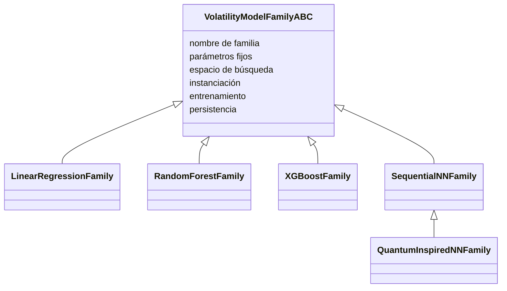
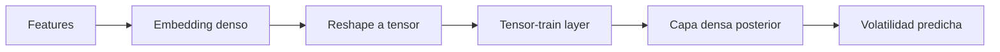

# Familias de modelos

Las familias de modelos comparten una abstracción común. Cada familia declara sus parámetros fijos, espacio de búsqueda, forma de construir el estimador, forma de entrenarlo y cómo guardarlo. Esto permite que el entrenador trate de forma uniforme modelos muy distintos.

## Regresión lineal

La regresión lineal es el baseline. Su forma general es:

$$
\hat{\sigma}=\beta_0+\sum_j \beta_j x_j
$$

Ventajas:

- Alta interpretabilidad.
- Bajo coste.
- Sirve como referencia de si las features financieras ya capturan gran parte de la estructura.

Limitaciones:

- No modela fácilmente smiles con curvatura compleja salvo por las features ya introducidas.
- No captura interacciones de alto orden si no están explícitamente presentes.

En entrenamiento progresivo puede recibir pesos de muestra para priorizar regiones más ATM.

## Random Forest

Random Forest promedia muchos árboles entrenados sobre variaciones de datos y features. Su predicción es:

$$
\hat{\sigma}(x)=\frac{1}{B}\sum_{b=1}^{B} T_b(x)
$$

Ventajas:

- Captura no linealidades.
- Tolera escalas distintas sin Normalización.
- Es relativamente robusto a outliers.

Hiperparámetros relevantes:

- Número de árboles.
- Profundidad máxima.
- Mínimos de muestras por split y hoja.
- Submuestreo de filas y columnas.
- Penalizaciones de complejidad.

En progressive training, igual que la lineal, usa pesos para dar más importancia relativa a observaciones cercanas a ATM.

## XGBoost

XGBoost construye árboles secuenciales que corrigen errores de los anteriores:

$$
\hat{\sigma}^{(m)}(x)=\hat{\sigma}^{(m-1)}(x)+\eta T_m(x)
$$

Ventajas:

- Alta capacidad predictiva.
- Regularización explicita.
- Early stopping por conjunto interno.
- Buen manejo de interacciones.

Hiperparametros relevantes:

- Número de estimadores.
- Learning rate.
- Profundidad máxima.
- Mínimos por hijo.
- Subsample y colsample.
- Regularización L1/L2.
- Número de rondas de early stopping.

En modo progresivo, el boosting se distribuye por fases: empieza entrenando con observaciones más ATM y va incorporando segmentos más alejados en moneyness.

## Red neuronal secuencial

La red secuencial usa capas densas, activaciones, dropout, regularización L2 y batch normalization opcional. Su forma conceptual es:

$$
h_1=\phi(W_1x+b_1), \quad
h_l=\phi(W_lh_{l-1}+b_l), \quad
\hat{\sigma}=W_oh_L+b_o
$$

Ventajas:

- Aproximacion flexible.
- Puede aprender interacciones suaves entre features.
- Historial de entrenamiento inspeccionable.

Particularidades:

- Escala features numéricas con un scaler guardado.
- Usa early stopping sobre RMSE de validación interna.
- Puede reducir learning rate cuando el entrenamiento se estanca.

## Red neuronal inspirada en tensores

Esta familia hereda la lógica neuronal, pero introduce una capa tensor-train. La idea es proyectar las features a un tensor pequeño y contraerlo mediante cores de bajo rango, buscando interacciones compactas:

La motivación es representar interacciones de forma más estructurada que una red densa pura. Los hiperparámetros controlan dimensiones tensoriales, ranks, unidades densas, regularización, dropout y learning rate.

## comparación conceptual

| Familia | Interpretabilidad directa | Flexibilidad | Coste | Necesita escalado |
| --- | --- | --- | --- | --- |
| Lineal | Alta | Baja | Bajo | No imprescindible |
| Random Forest | Media | Media-alta | Medio | No |
| XGBoost | Media | Alta | Medio-alto | No |
| Red secuencial | Baja | Alta | Alto | Si |
| Red tensor-train | Baja-media | Alta | Alto | Si |

Los modelos equivalentes del [dashboard](../dashboard/index.md) complementan esta tabla: incluso si el modelo principal es complejo, se generan árboles y expresiones simbólicas que aproximan su comportamiento.

