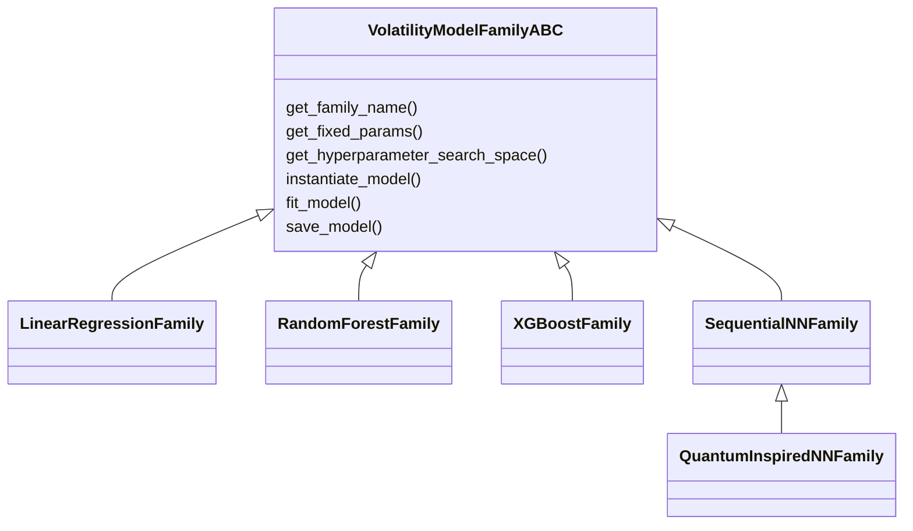
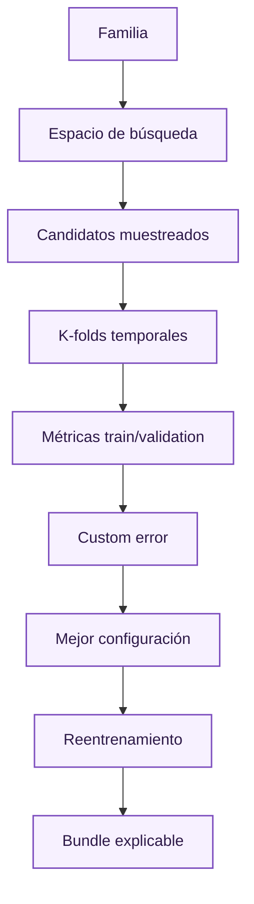

# Familias de modelos

Esta página compara las familias implementadas. El detalle de cada familia está separado en páginas propias: [regresión lineal](families/linear-regression.md), [Random Forest](families/random-forest.md), [XGBoost](families/xgboost.md), [redes neuronales](families/neural-networks.md) y [red tensor-train](families/tensor-train.md).

Todas las familias comparten una abstracción común (`VolatilityModelFamilyABC`). Cada una declara parámetros fijos, espacio de búsqueda, instanciación, entrenamiento, persistencia y número de configuraciones exploradas.

## Comparativa conceptual

| Familia | Interpretabilidad directa | Flexibilidad | Coste | Escalado | Página |
| --- | --- | --- | --- | --- | --- |
| Regresión lineal | Alta | Baja-media | Bajo | No imprescindible | [Detalle](families/linear-regression.md) |
| Random Forest | Media | Media-alta | Medio | No | [Detalle](families/random-forest.md) |
| XGBoost | Media-baja | Alta | Medio-alto | No | [Detalle](families/xgboost.md) |
| Red secuencial | Baja | Alta | Alto | Sí | [Detalle](families/neural-networks.md) |
| Red tensor-train | Baja | Alta | Alto | Sí | [Detalle](families/tensor-train.md) |

## Criterio de selección

La selección no se basa en una única ejecución. El pipeline genera candidatos por familia, evalúa por [k-folds temporales](splits-kfolds.md), calcula métricas agregadas y selecciona mediante una métrica compuesta que penaliza error, inestabilidad entre folds y sobreajuste.

## Relación con explicabilidad

Los modelos más flexibles no son descartados por ser menos interpretables directamente. El proyecto genera artefactos de explicabilidad para todos los modelos finales: [SHAP](../dashboard/global/shap-fundamentals.md), [árboles surrogate](../dashboard/global/surrogate-trees.md), [regresión simbólica](../dashboard/global/symbolic-regression.md), [ICE](../dashboard/behaviour/ice.md), [ALE](../dashboard/behaviour/ale.md) y superficies.

La comparación final debe separar tres dimensiones:

| Dimensión | Pregunta |
| --- | --- |
| Rendimiento | Qué modelo predice mejor volatilidad implícita en test. |
| Estabilidad | Qué modelo es menos sensible a folds, early stopping o regiones de moneyness. |
| Explicabilidad | Qué modelo puede justificarse con contribuciones, reglas, fórmulas y superficies coherentes. |

