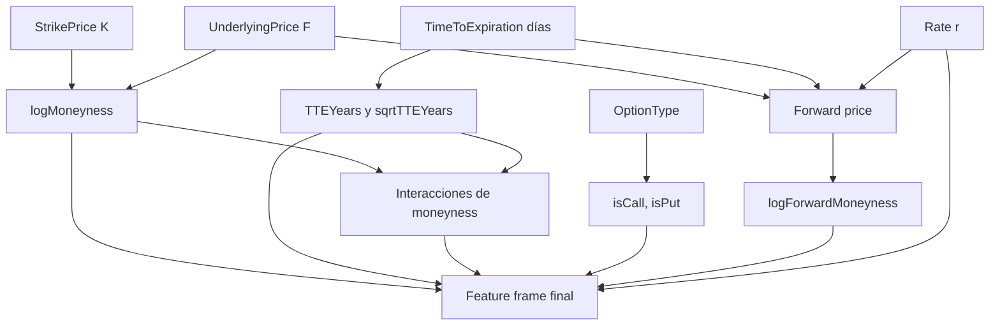
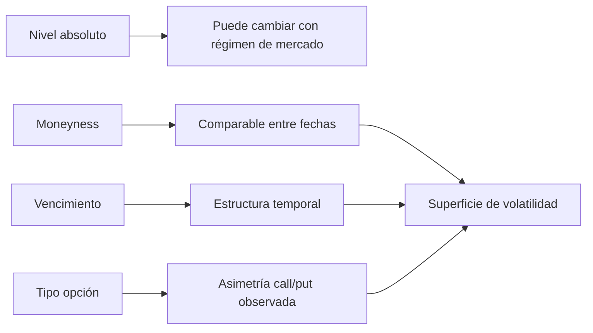

# Características del modelo

Las features se diseñan para representar la geometría financiera de la superficie de volatilidad. En lugar de entrenar directamente con strike y subyacente como magnitudes separadas, se construyen variables relativas que son más estables entre niveles de mercado.

## Variables originales

Las entradas raw del modelo son:

| Variable | Significado |
| --- | --- |
| `OptionType` | Tipo call/put. |
| `StrikePrice` | Strike de la opción. |
| `UnderlyingPrice` | Precio del futuro subyacente asociado temporalmente. |
| `TimeToExpiration` | Tiempo restante hasta vencimiento, en días. |
| `Rate` | Tipo de interés compuesto hasta vencimiento. |

Estas variables también son las que se exponen al usuario en predicción manual, porque son interpretables y suficientes para reconstruir el vector de entrenamiento.

## Features derivadas

El vector final incluye:

| Feature | Fórmula | Motivo |
| --- | --- | --- |
| `TTEYears` | $T=\frac{T_{días}}{365}$ | Normaliza vencimiento a años. |
| `sqrtTTEYears` | $\sqrt{T}$ | Aparece naturalmente en Black-76 y captura escala temporal no lineal. |
| `logMoneyness` | $\log(F/K)$ | Describe posición relativa frente al strike. |
| `logMoneynessSq` | $\log(F/K)^2$ | Captura curvatura de smile. |
| `logMoneynessXSqrtTTE` | $\log(F/K)\sqrt{T}$ | Captura interacción smile-vencimiento. |
| `logForwardMoneyness` | $\log(F e^{rT}/K)$ | Incluye desplazamiento por tipo en el forward ajustado. |
| `rate` | $r$ | Conserva sensibilidad directa a tipos. |
| `isCall` | indicador call | Codifica tipo de opción. |
| `isPut` | indicador put | Codifica tipo de opción. |

## Moneyness

La moneyness se mide como:

\[
m=\frac{F}{K}
\]

donde:

- $m$ es la moneyness.
- $F$ es el precio del futuro subyacente.
- $K$ es el strike.

y su versión logaritmica:

\[
\ell=\log(m)=\log(F/K)
\]

donde:

- $\ell$ es la log-moneyness.
- $m$ es la moneyness.
- $F$ es el futuro subyacente.
- $K$ es el strike.

La log-moneyness es simétrica alrededor de ATM: cuando $F=K$, $\ell=0$. Valores positivos y negativos representan regiones a distinto lado del strike con una escala más natural para modelos.

## Forward moneyness

El proyecto usa:

\[
F^{adj}=F e^{rT}
\]

donde:

- $F^{adj}$ es el forward ajustado por tipo y vencimiento.
- $F$ es el futuro subyacente.
- $r$ es el tipo de interés.
- $T$ es el vencimiento en años.

\[
\ell_F=\log(F^{adj}/K)
\]

donde:

- $F^{adj}$ es el forward ajustado por tipo y vencimiento.
- $F$ es el futuro subyacente.
- $r$ es el tipo de interés.
- $T$ es el vencimiento en años.

Esta variable incorpora el efecto del tipo y el vencimiento sobre la relación forward-strike. Aunque Black-76 ya toma $F$ como futuro, esta transformación da al modelo una variable donde tipos y tiempo interactúan explícitamente.

## Por qué estas features

La volatilidad implícita suele organizarse por moneyness y vencimiento, no por niveles absolutos de strike. Un mismo strike puede representar estados muy distintos si el IBEX está en otro nivel. Por eso se priorizan variables relativas y transformadas.

## Features para dashboard

El [dashboard](../dashboard/index.md) conserva tanto inputs raw como features derivadas. Esto permite dos vistas:

- Vista financiera: strike, subyacente, tiempo, tipo y tipo de opción.
- Vista de modelo: moneyness, log-moneyness, vencimiento en años, indicadores y features transformadas.

Para explicabilidad global y local, las explicaciones se calculan sobre las features visibles de entrada cuando se necesita una lectura más cercana al usuario, y sobre el vector transformado cuando se necesita fidelidad al runtime del modelo.

