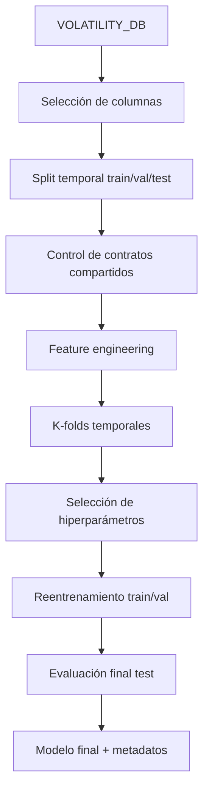
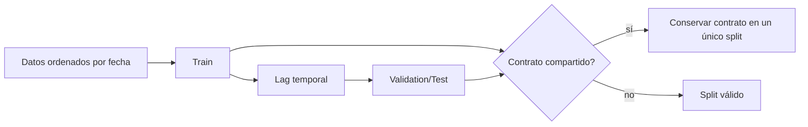

# Modelos de volatilidad: visión general

La parte de modelos toma [`VOLATILITY_DB`](../data/volatility.md), genera variables financieras y entrena varias familias de regresión para aproximar la volatilidad implícita. El diseño separa tres problemas:

1. Construir un dataset sin fugas temporales.
2. Comparar familias e hiperparámetros de forma robusta.
3. Guardar modelos y metadatos suficientes para reproducir y explicar resultados.

## Variable objetivo

La variable objetivo es `ImpliedVolatility`, calculada durante el ETL mediante inversión Black-76. El modelo aprende una aproximación:

\[
\hat{\sigma}=f(X)
\]

donde:

- $\hat{\sigma}$ es la volatilidad implícita predicha.
- $f$ es el modelo entrenado.
- $X$ o las variables entre paréntesis son las entradas financieras del modelo.

donde $X$ no son directamente todas las columnas raw, sino una representación financiera compacta basada en vencimiento, moneyness, tipo y tipo de opción.

## Datos usados para entrenamiento

La configuración conserva de `VOLATILITY_DB`:

- Fecha-hora de ejecución.
- Código de contrato de opción.
- Tipo de opción.
- Strike.
- Precio del subyacente.
- Tiempo a vencimiento.
- Tipo de interés.
- Volatilidad implícita.

El código de contrato y la fecha-hora se conservan como contexto auxiliar para splits y trazabilidad, no como predictores finales del modelo. Esta separación es importante: usar identificadores directos de contratos podría inducir memorización.

## Familias entrenadas

El proyecto implementa cinco familias:

| Familia | Papel en el estudio |
| --- | --- |
| Regresión lineal | Baseline interpretable y control de complejidad. |
| Random Forest | Modelo no lineal robusto con interacciones por particiones. |
| XGBoost | Boosting regularizado con early stopping y alto poder predictivo. |
| Red neuronal secuencial | Aproximador flexible con capas densas. |
| Red tensor-train | Variante neuronal que fuerza una estructura compacta de interacciones. |

Todas comparten una interfaz de familia, lo que permite entrenarlas, seleccionar hiperparámetros, reentrenarlas y guardarlas siguiendo el mismo flujo.

## Metadatos generados

El entrenamiento deja dos tipos de metadatos:

- Metadatos de familia: resultados de búsqueda de hiperparámetros por k-folds, parámetros probados, mejor configuración y métricas agregadas.
- Metadatos de reentrenamiento: resultados del mejor modelo entrenado sobre train/val o trainval/test, historial de entrenamiento cuando aplica, mejor iteración y métricas finales.

Estos metadatos son tan importantes como el fichero del modelo, porque explican por qué se eligió una configuración y cómo se comportó fuera de muestra.

## Ausencia de lookahead y data snooping

El proyecto aplica dos defensas, desarrolladas con más detalle en [Splits temporales y k-folds](splits-kfolds.md):

- Orden temporal: train siempre precede a validation, y validation precede a test. Además, se deja un lag de fechas entre train y test cuando la configuración lo permite.
- Exclusividad de contratos: si un mismo contrato de opción aparece en dos splits, se asigna a un único split según prioridad y se eliminan filas del otro. Así se evita que el modelo vea en entrenamiento el mismo contrato que luego aparece en validación o test.

Esta decisión es especialmente relevante en opciones: un contrato puede negociarse durante muchos días. Si se comparte contrato entre entrenamiento y validación, el modelo puede aprender rasgos idiosincráticos del contrato y dar una estimación optimista.

