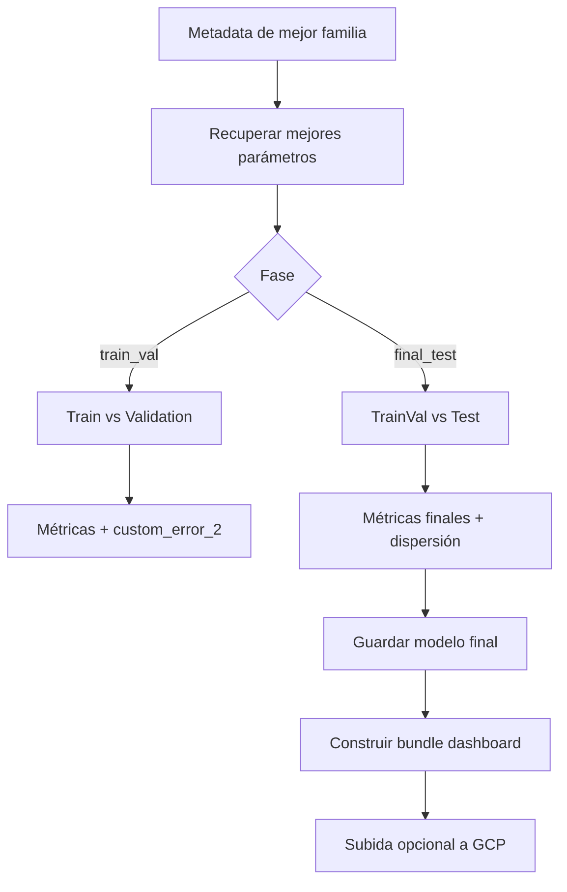

# Reentrenamiento y progressive training

Después de seleccionar hiperparámetros por [k-folds temporales](splits-kfolds.md), el proyecto reentrena la mejor configuración. Hay dos fases principales: una fase train/validation para confirmar rendimiento y una fase final test para producir el modelo que se guarda y se convierte a [bundle de dashboard](../dashboard/model-to-dashboard.md).



## Reentrenamiento no progresivo

En entrenamiento no progresivo, el modelo recibe todo el bloque de entrenamiento de la fase de una vez. Si la familia es iterativa, se crea una partición interna para early stopping; si no lo es, ajusta directamente sobre todo el bloque permitido.

Este modo representa el entrenamiento estándar:

$$
\min_{\theta} \sum_{i \in Train} L(y_i, f_{\theta}(x_i))
$$

Ventajas:

- Usa toda la información disponible de forma uniforme.
- Es sencillo de comparar entre familias.
- Evita introducir una preferencia explícita por regiones de la superficie.

## Progressive training

El entrenamiento progresivo ordena observaciones por cercanía a ATM usando la magnitud de la log-moneyness:

$$
|\ell| = |\log(F/K)|
$$

Luego divide el entrenamiento en segmentos. El primer segmento contiene observaciones más cercanas a ATM; los siguientes incorporan progresivamente regiones más alejadas.

```mermaid
flowchart LR
    A[Ordenar por |logMoneyness|] --> B[Segmento 1: más ATM]
    B --> C[Segmento 2: ATM + intermedio]
    C --> D[Segmento 3: ATM + intermedio + alas]
    D --> E[Modelo final]
```

La intención financiera es estabilizar primero la zona más líquida y central de la superficie. Las regiones muy OTM o ITM pueden ser más ruidosas, menos líquidas o más sensibles a microestructura. Empezar por ATM fuerza al modelo a aprender primero el nivel central de volatilidad y luego extenderse a las alas.

## Diferencias por familia

| Familia | Progressive training |
| --- | --- |
| Lineal | Usa pesos de muestra mayores en segmentos más ATM. |
| Random Forest | Usa pesos de muestra mayores en segmentos más ATM. |
| XGBoost | Entrena fases acumulativas, repartiendo estimadores entre segmentos. |
| Red secuencial | Entrena sucesivamente sobre datasets acumulados por segmento. |
| Red tensor-train | Sigue el esquema progresivo de la familia neuronal. |

La diferencia clave es que modelos no iterativos reciben el sesgo ATM como pesos, mientras que modelos iterativos pueden aprender por fases.

## Pesos por segmento

Conceptualmente, si hay \(S\) segmentos ordenados de ATM a alas, los pesos decrecen con el segmento:

$$
w_s \propto S-s
$$

y se normalizan para mantener escala media estable:

$$
\tilde{w}_i=\frac{w_i}{\bar{w}}
$$

Esto no elimina las alas; solo reduce su influencia relativa al inicio o en el objetivo ponderado.

## Métricas adicionales de reentrenamiento

En reentrenamiento se calculan métricas base y métricas de dispersión:

- Desviación estándar de volatilidad real.
- Desviación estándar de predicciones.
- Desviación estándar de residuos.

Estas métricas ayudan a detectar modelos que aciertan RMSE pero comprimen demasiado la variabilidad, o que generan residuos más dispersos en evaluación.

## Modelo final

En fase final test, el modelo se ajusta con trainval y se evalúa contra test. Después se guarda:

- Estimador final.
- Scaler si la familia lo necesita.
- Metadatos de reentrenamiento.
- Artefactos de dashboard.

El [dashboard](../dashboard/index.md) se construye automáticamente después de guardar el modelo final. Esto garantiza que los artefactos visuales corresponden al mismo modelo que se acaba de evaluar.

## Relación con Explicabilidad

Progressive training no es solo una variante de optimización. Afecta a la forma de la superficie aprendida. Por eso el nombre del modelo final conserva si es progresivo, y el dashboard puede compararlo como una familia distinta. Así se puede inspeccionar si entrenar más ATM produce:

- Superficies más suaves alrededor de ATM.
- Menos error central.
- Cambios en smiles y term structures.
- Diferente importancia relativa de moneyness y vencimiento.


