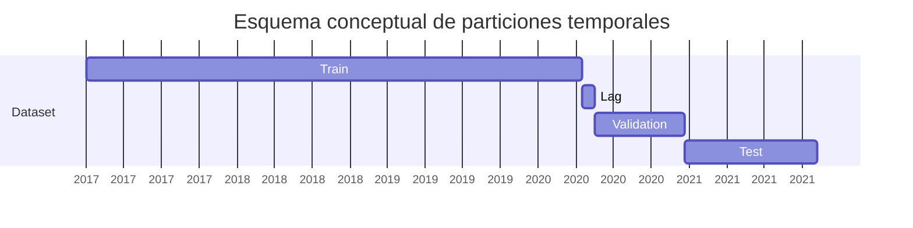
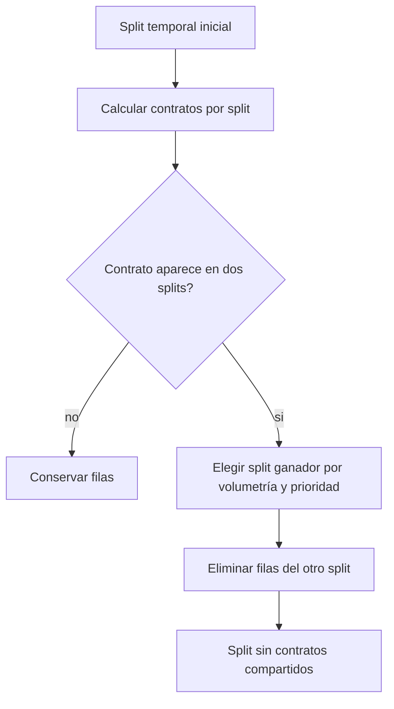
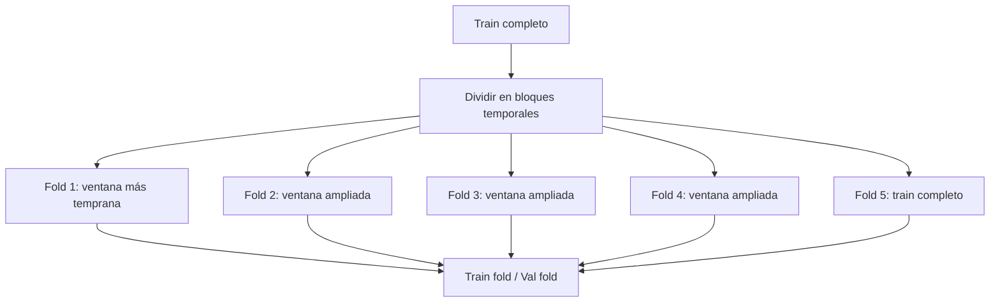

# Splits temporales y k-folds

El proyecto trata el tiempo como una restricción de diseño. En datos financieros no se debe entrenar con información posterior a la fecha que se evalúa. Por eso los splits no son aleatorios a nivel global: se ordenan por fecha de ejecución y se cortan temporalmente.

## Split train/validation/test

La lógica general es:

1. Ordenar observaciones por fecha de ejecución.
2. Dividir por fechas únicas, no por filas aisladas.
3. Reservar una parte final para test.
4. Aplicar un lag temporal cuando sea posible.
5. Dentro del bloque trainval, crear train y validation con la misma política.

El lag reduce contaminación por proximidad temporal. En opciones, sesiones consecutivas pueden contener contratos y estados de mercado muy parecidos; separar unos días hace más conservadora la evaluación.

## Exclusividad de contratos

Después de cada corte temporal se comprueba si hay contratos de opción compartidos entre splits. Si un contrato aparece en ambos lados, se asigna a un único split según volumetría y prioridad:

- La volumetría decide primero: para cada contrato se conserva el split donde aparece con más filas.
- La prioridad del split actúa como desempate cuando el mismo contrato tiene igual número de filas en ambos lados.
- Las filas del contrato se eliminan del split perdedor para que no haya contratos compartidos entre train, validation y test.

La razón es evitar que el modelo observe un contrato durante entrenamiento y luego sea evaluado sobre el mismo contrato en otra fecha. Aunque la fila sea posterior, el identificador contractual puede estar correlacionado con strike, vencimiento y régimen de volatilidad. La regla por volumetría reduce la pérdida de datos del contrato; la prioridad aporta determinismo cuando la volumetría no basta para decidir.

## K-folds temporales

Los k-folds se construyen dentro del conjunto de train. No se usan filas de validation final ni de test final durante la búsqueda de hiperparámetros. El enfoque es de ventanas temporales crecientes o recortadas desde el final: cada fold contiene un bloque efectivo, y dentro de ese bloque se vuelve a aplicar split temporal train/val.

El número de folds y bloques extra se configura. Los bloques extra permiten que las ventanas tengan suficiente historia antes de validar, evitando folds demasiado pequeños al principio.

## Lookahead bias

Hay tres puntos donde se evita lookahead:

- El ETL asigna a cada opción el último trade del futuro con hora anterior o igual.
- Los splits de entrenamiento respetan el orden temporal.
- El early stopping usa una partición interna del bloque de entrenamiento, no el test final.

Formalmente, si una observación evaluada ocurre en $t_j$, el entrenamiento usado para selección o ajuste no debe incluir observaciones de $t>t_j$ en el mismo proceso de decisión.

## Data snooping

El data snooping se controla separando selección y evaluación:

| Fase | Datos usados | Qué decide |
| --- | --- | --- |
| K-folds | Train interno | Hiperparámetros y familia candidata. |
| Reentrenamiento train/val | Train y validation | Calidad del mejor conjunto de parámetros antes de test. |
| Final test | Trainval para ajustar, test para evaluar | Resultado final fuera de muestra. |
| Dashboard | Test para diagnóstico | Visualización y explicabilidad, no selección de hiperparámetros. |

El test final se usa para medir y visualizar, no para escoger hiperparámetros.

