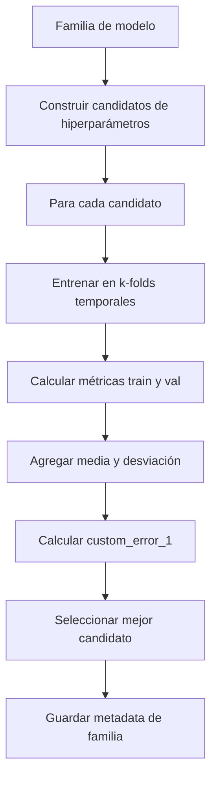
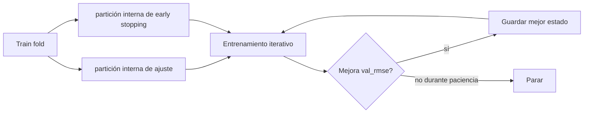

# Entrenamiento y selección

El entrenamiento se organiza en dos niveles. Primero se exploran hiperparámetros por familia mediante [k-folds temporales](splits-kfolds.md). Después se toma la mejor configuración y se reentrena en fases posteriores.

## Búsqueda de hiperparámetros

Cada familia define su espacio de búsqueda. Cuando el espacio es vacío, se entrena una única configuración. Cuando hay múltiples opciones, se muestrean configuraciones con semilla fija para reproducibilidad.

La búsqueda no agota necesariamente todo el espacio. Para familias grandes, el número de iteraciones está acotado. El sistema registra cuántas configuraciones se han explorado frente a la cardinalidad máxima.

## Métricas base

Las métricas base son:

$$
MAE = \frac{1}{n}\sum_i |y_i-\hat{y}_i|
$$

$$
RMSE = \sqrt{\frac{1}{n}\sum_i (y_i-\hat{y}_i)^2}
$$

$$
R^2 = 1-\frac{\sum_i (y_i-\hat{y}_i)^2}{\sum_i (y_i-\bar{y})^2}
$$

Se calculan para train y validation en cada fold. Luego se agregan media y desviación estándar entre folds.

## Métrica de selección

La selección no usa solo RMSE medio. Usa una métrica compuesta que penaliza:

- Error de validation.
- Variabilidad entre folds.
- Gap de sobreajuste cuando validation es peor que train.

$$
CE_1 = RMSE_{val}+\alpha \cdot std(RMSE_{val})+\beta \cdot \max(0, RMSE_{val}-RMSE_{train})
$$

Esto evita elegir una configuración que gane por poco en un fold pero sea inestable o claramente sobreajustada.

## Early stopping

El early stopping aparece en las familias con entrenamiento iterativo:

- XGBoost usa un conjunto interno de validación para detener boosting cuando no mejora.
- Redes neuronales monitorizan RMSE de validación interna y restauran los mejores pesos.
- Las redes pueden reducir learning rate si el progreso se estanca.

El conjunto externo de validation del fold no se usa para ajustar early stopping; se reserva para estimar rendimiento del candidato. Esto mantiene separadas las decisiones internas de optimización y la evaluación del fold.

## Escalado

Las familias neuronales guardan un scaler para features numéricas. El scaler se ajusta solo con datos permitidos en la fase correspondiente. En evaluación final, el scaler se ajusta con el bloque de entrenamiento disponible y se aplica a test sin aprender de test.

Los modelos de árboles y la regresión lineal se guardan sin scaler adicional en el flujo actual.

## Artefactos de entrenamiento

Al terminar la búsqueda por familia se guarda:

- Nombre de familia.
- Mejor candidato.
- Parámetros del mejor candidato.
- Tabla de métricas de todos los candidatos.
- Métricas por fold.
- Predicciones de validación usadas para gráficos.
- Historial de épocas cuando la familia lo produce.

Estos metadatos permiten reconstruir la justificación de selección sin reentrenar todo.

