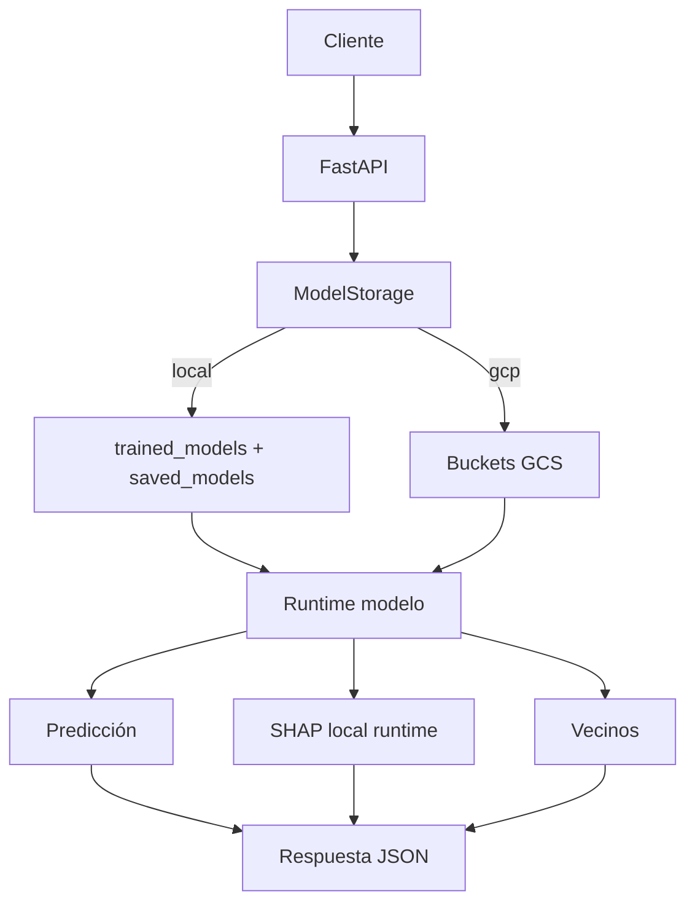
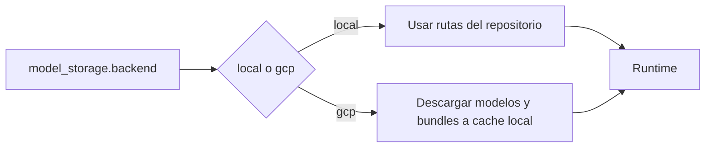
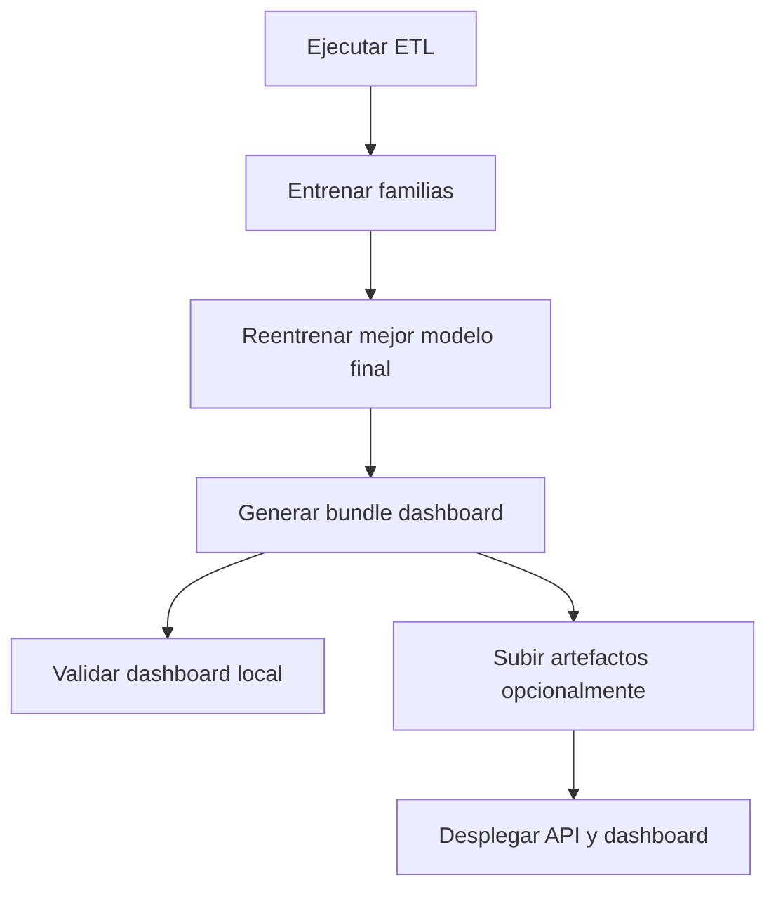

# API, almacenamiento y despliegue

Además del dashboard, el proyecto incluye una API FastAPI y configuración de despliegue. La API permite ejecutar predicciones y explicabilidad local de muestras manuales usando los mismos modelos y bundles que el dashboard.

## API de predicción

La API expone un endpoint de predicción que recibe:

- Modelo.
- Tipo de opción.
- Strike.
- Precio de subyacente.
- Tiempo a vencimiento.
- Tipo.
- Opcionalmente código de contrato y volatilidad real.

La respuesta incluye modelo, predicción y eco normalizado de la entrada. Internamente, se reconstruye el frame raw, se generan features y se ejecuta el modelo entrenado.

## API de explicabilidad local

La explicabilidad local manual devuelve:

- Predicción.
- Imagen waterfall codificada.
- Payload SHAP local.
- Vecinos históricos.
- Distancias a vecinos.

Este flujo es más costoso que una predicción simple, porque calcula una explicación SHAP de runtime para la muestra manual. Usa un fondo muestreado del bundle de dashboard.

## Almacenamiento local y GCP

El backend se configura en `clientserver.json`.

En local, API y dashboard leen directamente:

- Modelos entrenados.
- Metadatos de reentrenamiento.
- Bundles de dashboard.

En GCP, los artefactos se sincronizan desde Cloud Storage a una cache local antes de cargarse.

## Dockerfiles

El repositorio separa imágenes de API y dashboard. Esta separación permite desplegar servicios independientes:

- API: orientada a endpoints HTTP de predicción y explicabilidad.
- Dashboard: orientado a Dash/Flask y visualización interactiva.

Ambas imágenes dependen de los mismos artefactos de modelos y configuración.

## Terraform

La carpeta `terraform/` define recursos de cloud:

- Buckets de almacenamiento.
- Artifact Registry.
- Cloud Run para API.
- Cloud Run para dashboard.
- IAM.
- Variables, locals y outputs.

El fichero `cloud_config.json` contiene parámetros de proyecto, región, service account, buckets y repositorio. Terraform materializa esos valores en infraestructura.

## Flujo operativo recomendado

La parte crítica es mantener sincronizados modelo, scaler, metadatos y bundle. Un bundle generado con un modelo distinto al desplegado produciría explicaciones inconsistentes. Por eso el pipeline de reentrenamiento final dispara la Construcción del bundle después de guardar el modelo.

