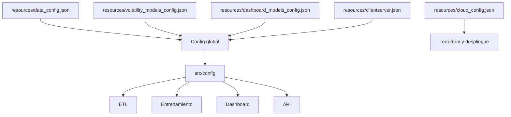
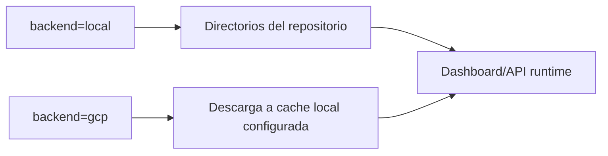

# Configuración y resources

La configuración del proyecto se concentra en `resources/`. El paquete `src/config` carga esos JSON y expone objetos tipados que el resto del código consume. Esta decisión hace que el comportamiento principal del sistema sea trazable sin modificar código: años de datos, columnas esperadas, nombres de ficheros, splits temporales, tamaños de muestras y parámetros de dashboard viven en ficheros declarativos.

## Configuración global

La configuración global resuelve primero la raíz del proyecto y crea las rutas necesarias. Esto garantiza que los paquetes puedan asumir que existen las carpetas donde se escribirán bases de datos, modelos, metadatos y bundles. La estructura de rutas relevante es:

| Grupo | Rutas principales |
| --- | --- |
| Datos fuente | `data/source_data/market_data`, `data/source_data/rates_data` |
| Pasos ETL | `data/raw_data`, `data/merge_raw_data`, `data/product_split_data`, `data/underlying_data`, `data/volatility_data` |
| Datos de entrenamiento | `data/training_data/splitted`, `data/training_data/splitted_features`, `data/training_data/kfolds` |
| Modelos | `src/volatility_models/trained_models` |
| Metadatos | `src/volatility_models/trained_metadata/family_metadata`, `src/volatility_models/trained_metadata/retrained_metadata` |
| Dashboard | `src/dashboard/saved_models` |

El patrón de lectura es siempre el mismo: el JSON define cadenas, listas y números; las clases de configuración los convierten a enums, rutas, tuplas o tipos Python adecuados; el resto del código accede a esos atributos a través de un objeto común.

## `data_config.json`

Este fichero define el ETL completo. Sus bloques principales son:

| Bloque | Contenido |
| --- | --- |
| `first_year`, `last_year` | Rango anual de ficheros fuente que se procesan. |
| `contract_code` | codificación de contratos IBEX: prefijos, longitud de códigos, posiciones de strike, mes y año. |
| `read_raw_step` | Prefijos de ficheros fuente, columnas seleccionadas y tratamiento EONIA/€STR. |
| `merge_raw_step` | Nombre de salida, columnas de unión, esquema final y hora de vencimiento. |
| `product_split_step` | Separación entre opciones y futuros, columnas resultantes y relación opción-subyacente. |
| `underlying_step` | Esquema de la base que enlaza operaciones de opción con la última operación disponible del futuro. |
| `volatility_step` | Parámetros del solver de volatilidad, filtro de tipo de operación, umbral de lag y esquema final. |

La parte de códigos de contrato es crítica porque permite validar e imputar información. Los prefijos `CIBX`, `PIBX` y `FIBX` identifican calls, puts y futuros IBEX. La longitud del contrato distingue opciones mensuales de futuros mensuales. Las posiciones declaradas para mes, año y strike permiten reconstruir vencimientos y strikes cuando la fuente de contratos no informa una fila completa.

## `volatility_models_config.json`

Este fichero configura los datos de entrenamiento y las métricas de selección:

| Elemento | Papel |
| --- | --- |
| `vol_db_cols` | Columnas de `VOLATILITY_DB` que se conservan antes de feature engineering. |
| `raw_model_input` | Inputs financieros originales del modelo. |
| `numeric_features` | Features derivadas que entran al entrenamiento. |
| `target_column` | Variable objetivo, la volatilidad implícita. |
| `train_test_split_config` | Proporción temporal train/test y lag entre bloques. |
| `kfolds_config` | Número de folds temporales y bloques extra usados para construir ventanas. |
| `custom_error_1` | Métrica compuesta para elegir hiperparámetros en validación cruzada. |
| `custom_error_2` | Métrica compuesta para comparar reentrenamientos train/validation. |
| `models_metrics` | Métricas base: MAE, RMSE y \(R^2\). |
| `required_scaler_models` | Familias que guardan scaler junto al estimador. |
| `progressive_training_config` | Número de segmentos y columna de moneyness usada para entrenamiento progresivo. |

Las métricas compuestas penalizan no solo error, sino también inestabilidad y sobreajuste. Conceptualmente:

$$
CE_1 = RMSE_{val} + \alpha \cdot std(RMSE_{val}) + \beta \cdot \max(0, RMSE_{val}-RMSE_{train})
$$

$$
CE_2 = RMSE_{val} + \gamma \cdot CE_1 + \beta \cdot \max(0, RMSE_{val}-RMSE_{train})
$$

La primera se usa en búsqueda por k-folds; la segunda resume el reentrenamiento contra validación.

## `dashboard_models_config.json`

Este fichero controla el coste y densidad de los artefactos explicables. No cambia el modelo entrenado; cambia el tamaño de las muestras, grillas y surrogates que se guardan para visualización.

| Parámetro | interpretación |
| --- | --- |
| `surrogate_depths` | Profundidades de árboles equivalentes. |
| `sample_option_size` | Número de muestras locales disponibles en la pestaña de sample explainability. |
| `behaviour_anchor_size` | Número de anclas precomputadas para superficies locales. |
| `neighbors_k` | Vecinos históricos por muestra. |
| `shap_background_size` | tamaño del fondo usado por SHAP. |
| `shap_explain_size` | Número de observaciones para explicabilidad global. |
| `surface_grid_size` | Resolución de las superficies locales. |
| `ice_sample_size` y `curve_points` | Densidad de curvas ICE. |
| `symbolic_*` | Presupuesto de búsqueda de regresión simbólica. |
| `cache_entries` | tamaño de cachés del dashboard. |

El balance aquí es entre riqueza visual y tiempo/peso de generación. SHAP, regresión simbólica y superficies son las partes más costosas.

## `clientserver.json`

Define si los modelos se cargan desde disco local o desde GCP, y declara cómo se conectan dashboard y API:

- URL base y timeout de la API.
- Cache local de modelos de API.
- Directorios locales de modelos entrenados, metadatos y bundles.
- Buckets y prefijos GCP equivalentes.
- Features visibles para entrada manual del dashboard.
- Número de vecinos para explicación local servida por API.

## `cloud_config.json`

Contiene parámetros de infraestructura: proyecto GCP, región, service account, bucket de estado Terraform, buckets de modelos y repositorio de Artifact Registry. Es un fichero de soporte para despliegue; el runtime de Python usa principalmente `clientserver.json`.

## Por qué centralizar la configuración

La centralización permite reproducibilidad. Un experimento completo queda definido por:

1. Versión de código.
2. Ficheros fuente de mercado y tipos.
3. JSON de configuración.
4. Artefactos persistidos.

Si se cambia un schema o un umbral, el cambio queda aislado y visible. Si se cambia una ruta de almacenamiento, dashboard y API pueden seguir usando el mismo contrato conceptual.

