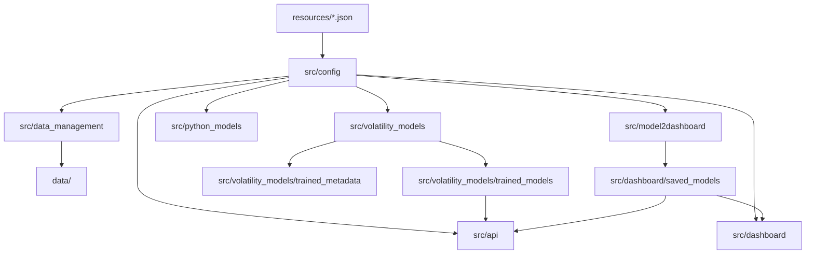
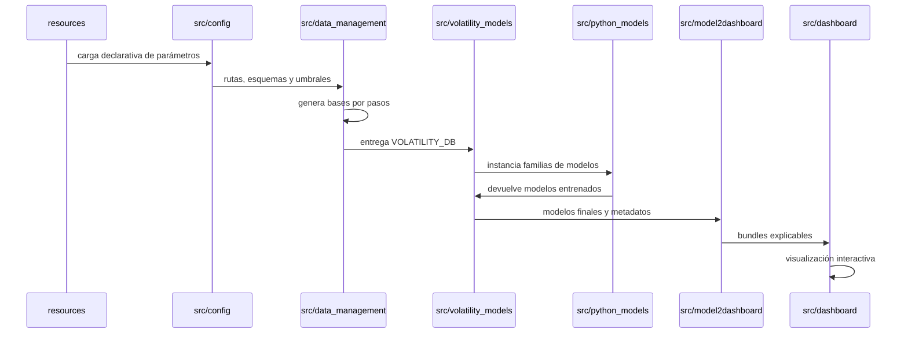
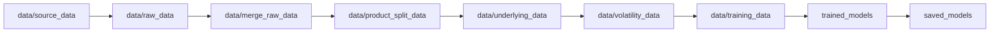

# Estructura del repositorio

El repositorio está organizado alrededor de cuatro ejes: configuración declarativa, procesamiento de datos, entrenamiento de modelos y visualización/serving. La convención principal es que `resources/` define parámetros y rutas lógicas, mientras que `src/` contiene paquetes especializados que consumen esa configuración.

## Raíz del proyecto

| Ruta | Papel |
| --- | --- |
| `resources/` | Configuración JSON del ETL, entrenamiento, dashboard, cliente-servidor y cloud. |
| `src/` | Código productivo organizado por dominio. |
| `data/` | Bases fuente y bases intermedias/finales generadas por el ETL. |
| `outputs/` | Salidas de análisis, gráficos y artefactos no esenciales para el runtime. |
| `tests/` | Pruebas unitarias y de integración por paquete. |
| `dockerfiles/` | imágenes separadas para API y dashboard. |
| `terraform/` | Infraestructura de despliegue en Google Cloud. |
| `doc/` | Documentación MkDocs creada para este proyecto. |

La raíz también contiene notebooks de exploración. Esos notebooks no son la fuente canónica de ejecución, pero documentan investigación, EDA, pruebas de modelos y análisis de explicabilidad que llevaron a la versión empaquetada del código.

## Flujo logico de ejecución

## Separación por responsabilidades

El diseño evita que una pieza conozca demasiados detalles de otra. El ETL no sabe cómo se entrenan los modelos; solo produce bases fiables. Las familias de modelos no saben cómo se renderiza el dashboard; solo ajustan y guardan estimadores. El paquete de [conversión a dashboard](../dashboard/model-to-dashboard.md) es el puente: toma modelos ya entrenados, los ejecuta sobre muestras del conjunto de test, calcula explicaciones y guarda todo en un formato estable para la UI.

Esta separación facilita volver a ejecutar partes concretas:

- Si cambia un umbral de calidad de datos, se regenera el ETL.
- Si cambian hiperparámetros o familias, se reentrenan modelos sin tocar el dashboard.
- Si cambian visualizaciones o tamaños de muestras explicables, se reconstruyen bundles de dashboard sin rehacer el ETL.
- Si el backend de almacenamiento pasa de local a GCP, la lógica de dashboard y API no cambia conceptualmente.

## Artefactos persistidos

Los artefactos más importantes son:

- Bases CSV intermedias en `data/`, una por paso de ETL.
- Ficheros de datos con features en `data/training_data/`.
- Modelos entrenados en `src/volatility_models/trained_models/`.
- Metadatos de búsqueda y reentrenamiento en `src/volatility_models/trained_metadata/`.
- Bundles explicables en `src/dashboard/saved_models/`.

## Lectura de esta sección

Las dos páginas siguientes detallan el mecanismo de [configuración](configuration.md) y la [estructura de paquetes de `src/`](src-packages.md). La documentación describe clases, paquetes y artefactos a nivel alto, evitando bajar al detalle de funciones concretas.

