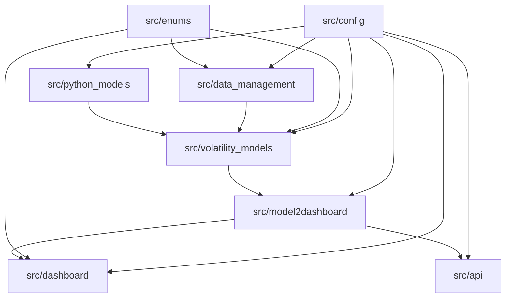

<!-- LTeX: language=es -->

# Paquetes de `src`

El directorio `src/` contiene los paquetes productivos. Cada paquete tiene una responsabilidad concreta y se comunica con los demás mediante artefactos o abstracciones estables.

## `src/config`

Carga los JSON de `resources/`, construye rutas absolutas y crea objetos de configuración por dominio. También inicializa logging. Es la primera pieza que se importa de forma transversal.

Estructura conceptual:

- Configuración de datos: códigos de contrato, pasos ETL y esquemas.
- Configuración de modelos: features, splits, k-folds, métricas y progressive training.
- Configuración de dashboard: tamaños de muestras, caches, SHAP, surrogates y PySR.
- Configuración cliente-servidor: backend local/GCP y rutas de modelos.
- Configuración de logging.

## `src/enums`

Centraliza nombres de columnas, tipos de contrato, tipos de opción, tipos de datos y enumeraciones de modelos. Esto reduce errores por cadenas escritas manualmente y hace que los esquemas de las bases sean consistentes.

La parte más importante para datos es `database_schema`, que representa las columnas esperadas en cada base intermedia:

- Contratos.
- Trades genéricos.
- Trades IBEX unidos.
- Trades de opciones.
- Trades de futuros.
- Relación opción-futuro.
- Opción con subyacente.
- Base final de volatilidad.
- Datos de entrenamiento.

## `src/data_management`

Contiene el ETL. Esta dividido en:

| Subpaquete | Responsabilidad |
| --- | --- |
| `loaders` | Orquestan cada paso, leen caché, validan entradas y devuelven DataFrames tipados. |
| `builders` | Construyen y persisten las bases de cada paso. |
| `utils` | Utilidades de tipos y códigos de contrato. |
| `main` | Punto de entrada secuencial del pipeline de datos. |

La estructura se repite por paso: lectura raw, unión raw, separación por producto, asignación de subyacente y cálculo de volatilidad.

## `src/volatility_models`

Gestiona los datos de entrenamiento, la validación temporal, el entrenamiento por familia, la selección de hiperparámetros, el reentrenamiento y la persistencia de modelos/metadatos.

Estructura conceptual:

- Utilidades de datos: carga de `VOLATILITY_DB`, split temporal, control de contratos compartidos y feature engineering.
- Utilidades de entrenamiento: métricas, k-folds, selección, reentrenamiento y subida opcional a GCP.
- Utilidades de visualización de entrenamiento: tablas, gráficos y curvas de aprendizaje.
- Carpetas de artefactos: modelos finales y metadatos.

## `src/python_models`

Son clases de Python que modelan funcionalidad. Es el lugar donde viven las abstracciones de familias de modelos y los modelos equivalentes usados por explicabilidad.

Componentes principales:

- Familia abstracta de modelos de volatilidad.
- Familias concretas: lineal, bosque aleatorio, XGBoost, red neuronal secuencial y red neuronal tensor-train.
- Modelo simbólico persistible.
- Estructuras de dashboard: bundle, SHAP almacenado, árbol surrogate, diagnóstico, PCA de vecinos y stub de API manual.

## `src/model2dashboard`

Es el puente entre entrenamiento y visualización. Carga modelos finales y metadatos, reconstruye features, genera predicciones sobre train/test, calcula artefactos explicables y escribe un bundle autocontenido en `src/dashboard/saved_models/`.

Artefactos que genera:

- Dataset de dashboard con predicción, residual y error absoluto.
- Muestras para explicabilidad local.
- Anclas para superficies.
- SHAP global y local.
- Árboles surrogate por profundidad.
- Regresor simbólico surrogate.
- Vecinos históricos.
- Superficies, ICE y ALE.
- Diagnóstico agregado.

## `src/dashboard`

Implementa la aplicación Dash. La estructura separa layout, callbacks, servicios, gráficos y utilidades.

| Subpaquete | Papel |
| --- | --- |
| `dashboard` | Layout, estilos, ids y callbacks. |
| `services` | Capa de aplicación: carga modelos, predice, calcula superficies, vecinos, SHAP y diagnósticos. |
| `plots` | Gráficos Plotly/imágenes para cada familia de visualizaciones. |
| `utils` | Validación, sampling, features auxiliares y diagnóstico. |
| `saved_models` | Bundles generados por `model2dashboard`. |

El dashboard no reentrena modelos. Consume bundles precomputados y, para entradas manuales, puede pedir predicciones/explicaciones a la API.

## `src/api`

Implementa una API FastAPI para predicción y explicabilidad local de muestras manuales. Carga el mismo modelo entrenado y el mismo bundle de dashboard que la UI, de modo que las respuestas de API y dashboard se basan en los mismos artefactos.

Endpoints conceptuales:

- Salud del servicio.
- Predicción de volatilidad.
- Predicción con explicabilidad local, waterfall y vecinos.

## `src/exceptions`

Define errores de datos específicos del dominio: claves duplicadas, valores missing, precios o cantidades no positivos, incoherencias de vencimiento, strikes inconsistentes, tiempos negativos y problemas de subyacente. Estos errores se lanzan durante validaciones de ETL para fallar pronto cuando una base intermedia no cumple contrato.

